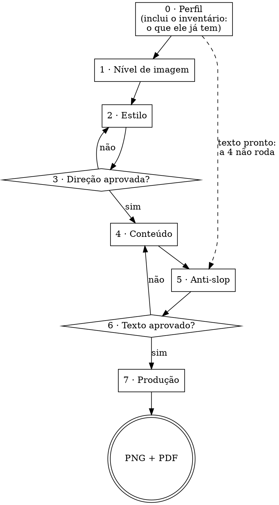

# Carroussel Please

Carrossel de feed com arte-final. **Toda tipografia é renderizada em HTML/CSS e capturada em PNG.** Modelo de imagem entra só onde não há palavra a ler.

Tudo de que a skill precisa está dentro dela. Nada aqui depende de outra skill estar instalada — ver [CREDITOS.md](CREDITOS.md).

## Os três princípios

**1. Modelo de imagem erra letra — e erra o acento primeiro.** Nenhuma palavra que o leitor vai ler sai de gerador de imagem. Nem o título, nem a paginação, nem o arroba. Não é preferência de qualidade: é a diferença entre entregar e refazer.

**2. Desenhar vem antes de gerar.** A maior parte do que um carrossel precisa — grade, blocos, ícones, abstração de interface, diagrama, tabela — se desenha em HTML/CSS/SVG com controle total e custo zero. **Interface desenhada em blocos ganha de print com filtro aplicado.** O gerador entra no que não se desenha: retrato, cena, textura, colagem. Ver [references/grafismos.md](references/grafismos.md).

**3. Nada avança sem aprovação.** Oito etapas com trava entre elas. Refazer oito cards renderizados custa muito mais do que uma pergunta.

## O fluxo



**O nível de imagem vem ANTES do estilo, e essa ordem é o coração do fluxo.** Ela já foi o
contrário, e não funcionava: a pergunta de imagem era meio número — "1.5" — depois de uma etapa
que terminava mostrando arte, e era pulada em toda sessão de teste. Invertida, ela deixa de ser
um detalhe e vira **funil**: cada nível favorece estilos diferentes, e a etapa 2 já abre com os
que funcionam melhor ali. O `exportar.sh` para se a decisão da etapa 1 não estiver gravada.

O protocolo de como perguntar — uma por vez, múltipla escolha, trava a cada bloco — está em [references/texto.md](references/texto.md). Este arquivo diz *o quê* e *em que ordem*.

## Onde a skill roda — e o que fazer quando falta o navegador

**A arte não é gerada, é impressa.** A skill escreve uma página com o card e um navegador tira a
foto dela em 1080×1350 — é daí que vem a letra certa, com acento. Isso torna o navegador um
requisito duro, e é o único que a skill tem.

Tudo o mais viaja dentro do pacote: as **15 fontes** em `assets/fontes/`, as **21 referências**,
o **board**, os dois esqueletos e os quatro scripts. Para os sete estilos, **rede não é
necessária em nenhum momento**.

| precisa | onde vive | se faltar |
|---|---|---|
| **navegador** (Chrome, Chromium, Brave, Edge) | no sistema | **não há etapa 7.** O `exportar.sh` procura em macOS e Linux, no PATH e no cache do Playwright, e **para com mensagem** se não achar |
| **bash e python3** | no sistema | sem os scripts, as travas não rodam — ver abaixo |
| mostrar imagem ao usuário | `open`, artefato, ou imagem na mensagem | use a rota que a superfície tiver; o importante é **confirmar que ele viu** |
| perfil | `~/.claude/`, ou a pasta do trabalho | pergunte o que faltar, e grave onde der |

### Sem navegador, entregue menos — e diga que é menos

**Não monte arte pela metade.** O que a skill entrega sem renderizador continua sendo trabalho
real, e é isto:

- o `TEXTOS.md` com o texto aprovado e a régua anti-slop passada
- o `DIRECAO.md` fechado: paleta, fontes, grade, e as linhas `estilo:` e `imagem:`
- o `cards.html` e o `fonts.css` prontos, com as fontes já embutidas em base64

E uma frase ao usuário, sem rodeio: *"aqui não tem como imprimir os PNGs. Está tudo pronto —
numa máquina com Chrome, um comando entrega a arte."*

**Por que isso importa mais do que parece.** Quase toda trava desta skill é executável: o
`exportar.sh` sozinho tem sete pontos de parada, e o que faz a etapa 1 não ser pulada é o board
abrir, não a regra estar escrita. **Prosa já falhou nos testes — foi por isso que as travas
viraram código.** Num ambiente sem execução, a skill volta a ser a versão que já se sabe que não
segura, e montar arte assim entrega defeito com cara de entrega.

## Três regras de conversa que valem o fluxo inteiro

### O usuário vê o carrossel dele uma vez: pronto

**Não existe preview antes da etapa 7.** Nem capa, nem card do meio, nem "um teste rápido para
você ver a direção". A primeira arte com o assunto dele que chega ao usuário é a arte final,
com o texto aprovado, o nível de imagem já decidido e os cards todos montados.

Isso não é economia de rodada, é o oposto: **preview cedo custa rodadas.** Ele chega antes do
nível de imagem, então mostra uma versão que nem sequer é a que vai ser produzida — desenhada
em código quando a decisão vai ser gerador, ou o contrário. O usuário opina sobre uma peça
descartável, o texto ainda é provisório, e metade dos comentários é sobre palavra que já ia
mudar. Duas vezes em teste a conversa parou para discutir um card que não existiria.

**A escolha de estilo não precisa de render** — para isso existem as 21 referências fixas em
`assets/referencias/`, que são imagens de verdade e mostram o estilo em três arquétipos de
layout. Escolhe-se olhando aquilo.

### Retomando um trabalho: as etapas já respondidas não se refazem

O fluxo está escrito para quem começa do zero, e **metade das sessões reais não começa do zero.**
O usuário chega com um `TEXTOS.md` aprovado numa conversa anterior e decide estilo e nível numa
frase só — *"com mcp higsfield layout risografia"*. Rodar as oito etapas em cima disso é
exatamente a queixa nº 1 de quem testa a skill, com a agravante de que agora tem razão.

| o que existe | o que isso fecha |
|---|---|
| `TEXTOS.md` com os blocos no formato | **etapas 4, 5 e 6** |
| `DIRECAO.md` com paleta, fontes e as linhas `estilo:` e `imagem:` | **etapas 1, 2 e 3** — e sem a linha `estilo:` a 2 **não** está fechada, por mais que a paleta esteja lá |
| o usuário nomeia estilo e nível na mesma frase | **etapas 1 e 2** |
| chapas ou gabaritos na pasta | o laço já rodou — **não regere** |

O que sobra é gravar o que falta no `DIRECAO.md` e ir para a etapa 7. E a confirmação vira **uma
linha só, afirmativa**, nunca uma bateria de perguntas:

> *"Montana Grind, 8 cards, @timeriding, risografia, gerador ligado. Certo?"*

**Antes de retomar, ecoe o que você leu do arquivo.** Uma linha: *"li 8 cards, assinatura
@timeriding, assunto Montana Grind"*. Custa uma frase e pega o erro que quase produziu um
carrossel inteiro do assunto errado — o usuário mandou o `TEXTOS.md` de outro trabalho, e só não
passou porque o conteúdo era obviamente de outro tema. Com dois trabalhos parecidos, passa.

### Antes de perguntar, tente parsear

A regra de **uma pergunta por mensagem** existe para o usuário não perder resposta num bloco de
cinco. Ela **não** autoriza reperguntar item a item o que ele já disse numa linha — aí ela vira o
próprio defeito que devia evitar.

Se a mensagem dele respondeu N etapas, **ecoe as N decisões numa frase afirmativa e peça o
aceite**. A regra de uma por vez vale para o que **falta**.

### Nunca pergunte duas vezes a mesma coisa

Na etapa 0 você já ficou sabendo: **quem assina, onde publica, o assunto e quantos cards.**
Nada disso se pergunta de novo mais adiante. Se precisar confirmar, **afirme e peça o aceite**
— "são sete cards, certo?" — nunca "quantos cards você quer?". Repetir a pergunta faz parecer
que você não estava prestando atenção, e é a queixa mais comum de quem testa a skill.

Antes de perguntar qualquer coisa, releia o que já foi dito na conversa. Se a resposta está lá,
use.

### Fale como quem explica para um cliente, não para outro programador

A pessoa do outro lado quer um post bonito. Ela não precisa saber como a peça é feita.

| não diga | diga |
|---|---|
| "vou renderizar em HTML/CSS e capturar via headless" | "vou montar a arte e te mostrar" |
| "aplicando duotone com mapeamento de rampa na paleta" | "vou deixar a foto nas cores do estilo" |
| "o corpo está com 28px, abaixo do piso" | "o texto ficou pequeno demais para o feed, vou subir" |
| "gerando o gabarito para extrair as coordenadas" | *não diga nada — isso é trabalho interno* |
| "detectei conflito na área de segurança" | "isso ia sumir no corte do LinkedIn, arrumei" |

**Etapa intermediária não se narra.** Gabarito, medição, teste de fonte, chapa limpa: some com
tudo. Quem pede um carrossel quer ver o carrossel.

E quando algo der errado, diga **o que ficou ruim e o que você vai fazer** — não o nome técnico
do defeito.

---

## Etapa 0 — Perfil

Leia `~/.claude/carrossel-perfil.md` — e, se não houver, `carrossel-perfil.md` na pasta do trabalho. **Se existir**, mostre um resumo de três linhas e pergunte só o que muda neste trabalho. **Se não existir em nenhum dos dois**, faça a conversa de setup e grave ao final, no primeiro caminho que for gravável.

**Há um terceiro estado, e ele é pedido com frequência:** *"esquece o que está salvo, faz como
se eu fosse novo"*. Quem acabou de instalar a skill quer testá-la na própria máquina, e o
perfil dele atrapalha o teste. Nesse caso rode o setup inteiro e **não leia o arquivo** — mas
**não sobrescreva nem apague o arquivo real**, e ao fim pergunte se o resultado deve substituir
o que estava lá. Se ele disse "ignore o gerador conectado" junto, trate como quem nunca
conectou nada: as opções sem conexão vão na conversa como se fossem as únicas.

As perguntas estão em [references/perfil.md](references/perfil.md), em quatro rodadas curtas e
**sem jargão**: quem publica · **o que já existe** · como parece · com o que produz.

### A rodada 2 é o inventário, e ela reescreve o fluxo

**Antes de qualquer pergunta de direção visual, saiba o que o usuário já tem pronto.** São duas
perguntas — o texto e as imagens —, e as respostas mudam etapas inteiras adiante:

| ele já tem | o que acontece |
|---|---|
| **o texto, pronto e aprovado** | **a etapa 4 não roda.** Leia, ecoe uma linha do que leu, passe a régua anti-slop e vá para a aprovação da etapa 6 |
| **um rascunho do texto** | a etapa 4 vira edição, não entrevista: aponte o que falta para fechar o arco e proponha só o delta |
| **as fotos** | são **material**, com os direitos de quem mandou. A etapa 1 continua rodando, mas só para os cards que sobrarem |
| **nada** | fluxo inteiro, como está escrito |

**Por que aqui e não adiante.** Perguntar direção visual antes disso é montar entrevista para
quem não precisa dela, e é a queixa nº 1 de quem testa a skill. Perguntar depois de já ter
entrevistado é pior: aí a rodada já foi gasta.

Isso é irmão da regra de [retomar um trabalho](#retomando-um-trabalho-as-etapas-já-respondidas-não-se-refazem)
e resolve o mesmo problema por outro caminho — lá o material está em arquivo de uma sessão
anterior, aqui o usuário traz na mão. Nos dois casos, **ecoe o que leu antes de seguir.**

Antes de propor estilo você precisa saber também: **o assunto e quantos cards**. Sem isso não dá para testar se uma direção escala.

## Etapa 1 — Nível de imagem

> **Esta é a primeira pergunta depois do perfil, é obrigatória e tem três opções.** Ela vem antes
> do estilo porque **é ela que filtra os estilos**: cada nível favorece uns e enfraquece outros.
> Se você chegou na etapa 4 e não sabe dizer se este trabalho é 1, 2 ou 3, você pulou uma etapa —
> volte e pergunte, mesmo que pareça tarde.

**O erro que se repete não é esquecer a pergunta, é reduzi-la a duas opções.** Em três testes
seguidos o meio sumiu: ou "tenho gerador conectado, gero tudo", ou "não tenho, desenho tudo em
código". **Banco de imagem aberto é a terceira, não conecta nada, e é a resposta certa para
metade dos assuntos** — quem tem tema fotografável e nenhuma conta de gerador cai exatamente
ali. Perguntar "quer gerar imagem ou desenhar?" é a pergunta errada, e é a que sai sozinha.

Pergunte pelo **resultado**, não pelo que a pessoa tem instalado. Ela escolhe o que quer e
depois descobre o que aquilo exige — o contrário faz escolher no escuro. E nada de "MCP",
"API" ou "nível A": ninguém que nunca conectou nada sabe o que é isso.

### Abra o board ANTES de perguntar

```bash
open <pasta-da-skill>/assets/board-niveis.jpg
```

**O board é a pergunta.** Ele mostra os três caminhos lado a lado, o que cada um custa, e — o
que a tabela de texto nunca conseguiu passar — **quais estilos combinam com cada caminho, com a
cara de cada um**. Perguntar sem mostrar transforma a decisão mais importante do fluxo em
formulário, e foi assim que ela virou item pulável duas versões seguidas.

Espere ele dizer que viu, como em qualquer entrega visual. Só então:

◇ **Como você quer as imagens do carrossel?**

| Opção | O que você ganha | O que precisa |
|---|---|---|
| **Sem foto nenhuma** | tudo desenhado em código, nas cores exatas do estilo | nada. Já funciona |
| **De banco grátis** | fotos de sites abertos, tratadas nas cores do estilo | nada. Já funciona |
| **Feitas sob medida** | o card inteiro é composto pelo gerador e a tipografia entra por cima, limpa | uma conta num gerador de imagem, ligada aqui. Te ajudo |

**Fale por nome, nunca por número.** "Nível 1" não quer dizer nada para quem chegou agora, e
número embaralha: o mais barato tem o número maior. Os números existem só no `DIRECAO.md`, que
é máquina lendo máquina — a correspondência está na etapa 3.

Três coisas ditas junto, em uma linha cada:

- **Só a sob medida responde ao seu assunto.** Nas outras duas você usa o que existe
- **Sem foto não é a versão pobre.** Em brutalista, terminal, neo-brutalismo e iridescente o
  desenho costuma ficar melhor que foto, porque nasce já nas cores certas
- **Banco depende do tema dar foto.** Relacionamento, viagem, comida, trabalho manual: rende.
  Um método, um conceito, uma ferramenta: não existe foto disso, e aí o desenho ganha

### Se ele trouxer uma referência própria

**Ofereça isso junto com o board, não depois:**

> *"Se você já tem uma referência que te agradou — um post, um cartaz, um print —, me manda.
> Eu leio ela e te digo qual desses caminhos ela pede."*

Uma referência trazida pelo usuário **responde à pergunta da etapa 1 ao contrário**: em vez de
ele escolher como as imagens são feitas, ele mostra como a peça parece, e de como ela parece se
deduz o que ela custa para fazer. É o jeito mais confortável de responder essa etapa, e o único
que não exige que ele entenda nada de produção.

**Antes de olhar, desfaça a ambiguidade** — são duas coisas diferentes com o mesmo nome, e
confundi-las coloca a foto do usuário dentro do card sem ninguém decidir isso:

◇ **Isso é uma referência de como você quer que fique, ou é uma imagem para entrar na arte?**

Imagem para entrar na arte é **material**, não referência: vai para o fluxo de quem entrega
arquivo pronto, e os direitos de uso são de quem mandou — diga isso uma vez, sem sermão.

**A leitura** — as cinco perguntas, o que devolver ao usuário e a regra de que **referência não
vira um oitavo estilo** — está em
[estilos.md](references/estilos.md#ler-uma-referência-trazida-pelo-usuário). São as mesmas cinco
em qualquer referência, e as respostas caem direto no critério do funil.

**Resolver não é escolher, e essa distinção já custou uma etapa inteira.** A leitura devolve
*"ela é praticamente a colagem"* — isso é **sugestão sua**, e a etapa 2 acontece igual: você abre
as três referências da colagem, mostra ao lado das do vizinho mais próximo, e **ele diz sim**.
Tratar a leitura como decisão fechada pula a etapa 2, e o sintoma é a escolha reaparecer no meio
da montagem como pergunta sobre um card que não fecha.

Se a referência for **PDF ou tiver várias páginas**, diga qual página você leu. Um PDF de
apresentação costuma ter capa, miolo e fecho com composições diferentes, e ler só a primeira
resolve para o estilo errado.

Grave no `DIRECAO.md`, e repare que são **duas linhas separadas de propósito**:

```markdown
referencia: caminho/do/arquivo.jpg · lida em AAAA-MM-DD · resolveu para colagem
estilo: colagem · aprovado por ele em AAAA-MM-DD
```

A segunda só se escreve depois do sim dele. **O `exportar.sh` para se ela não existir.**

E uma linha que evita um mal-entendido caro: **referência é referência, não modelo para copiar.**
A peça sai no sistema do estilo escolhido, não decalcada — e é isso que a mantém sua.

### Se escolheu **feitas sob medida**

◇ **Você já tem conta em algum gerador de imagem?**

Diga a verdade **antes** de tentar, porque metade dos casos não conecta:

| conta | dá para ligar? |
|---|---|
| **Gemini** | sim, e é o mais fácil. A chave é grátis |
| **ChatGPT Plus ou Pro** | **a assinatura não serve.** O acesso automático é cobrado à parte |
| **Higgsfield, Magnific** | sim, pelos conectores. Gasta crédito da assinatura |
| **Midjourney** | não dá para ligar. Mas dá para gerar por lá e me entregar o arquivo |

Essa última linha vale para qualquer conta que não conecte: **gerar na mão e entregar o
arquivo funciona.** Não é o ideal, é melhor do que desistir da imagem.

Não tendo conta nenhuma, ofereça banco ou desenho — não empurre assinatura.

O passo a passo de cada ligação está em [references/geradores.md](references/geradores.md).
Em todos: **a chave nunca é colada no chat** — o que passa por aqui fica registrado. A pessoa
guarda no computador dela e responde só "pronto". A skill grava o fato,
`gemini: chave configurada em AAAA-MM-DD`, nunca o valor.

### Se ele já tem as fotos

Veio da rodada 2 do perfil, e **não é uma quarta opção do board** — é uma resposta parcial. As
fotos dele resolvem os cards que elas cobrem; a pergunta continua valendo para o resto, e o
**tratamento continua vindo do estilo**.

Três coisas, uma linha cada:

- **Pergunte quantos cards elas cobrem.** Se não cobrem todos, o resto sai de banco ou de
  desenho — e isso é decisão dele, dita agora, não descoberta na entrega
- **Foto pronta não dispensa tratamento.** Ela entra na paleta e no material do estilo como
  qualquer outra. Sem isso, lê como colagem de duas peças diferentes
- **Os direitos são de quem mandou.** Diga uma vez, sem sermão

No funil, foto do usuário lê como **banco aberto**: a massa da peça é foto processada, então os
estilos que abrem primeiro são colagem e risografia. Grave `imagem: 2 · fotos do usuário`.

### Se escolheu **de banco grátis**

**Dupe** e **Openverse**, nesta ordem, e a busca é por **assunto — nunca por estilo**: quem
busca "minimal aesthetic" traz foto de banco com a paleta por cima, que é o defeito. O estilo
entra depois, no tratamento. A regra inteira, com os filtros de licença e o tratamento por
estilo, está em [references/grafismos.md](references/grafismos.md#banco-de-imagem--se-buscar-assunto-nunca-estilo).

Uma coisa dita agora, não na entrega: **o banco não responde ao seu assunto, ele responde ao
que existe.** Se as buscas voltarem fracas, a saída é a 3 naquele card — desenho em código —, e
isso se diz na hora, não se disfarça com foto quase certa.

### Se escolheu **sem foto nenhuma**

Nada a ligar. Vá para [references/grafismos.md](references/grafismos.md), que é o repertório do
que se desenha: grade, blocos, diagrama, abstração de interface, ícone, tabela.

### Fechado o nível, ele abre a etapa 2

**Não anuncie a resposta como se fosse só um registro.** O nível acabou de decidir por onde a
escolha de estilo começa, e dizer isso em uma linha faz a etapa seguinte parecer o que ela é —
uma consequência, não um menu novo:

> *"Sem foto então. Nesse caso dois estilos são feitos sob medida para isso, vou te mostrar
> primeiro: terminal e iridescente."*

O board já preparou o terreno — ele mostra os estilos agrupados por caminho, e o usuário chega na
etapa 2 sabendo que existem sete e por que dois deles vieram primeiro.

A tabela do funil está na etapa 2, e o critério inteiro em
[references/estilos.md](references/estilos.md#o-critério-de-onde-vem-a-espessura-da-peça).

## Etapa 2 — Estilo

São **sete, fixos**, especificados em [references/estilos.md](references/estilos.md) com paleta em hex, par tipográfico, material e o cuidado verificado de cada um:

| | Estilo | Em uma linha | vive de |
|---|---|---|---|
| 1 | **Brutalista vetorial** | forma chapada de aresta dura sobre papel cru, tipografia condensada como material | forma |
| 2 | **Risografia com textura** | duas tintas que se multiplicam, erro de registro, retícula e fibra | **foto processada** |
| 3 | **Terminal** | paleta de editor de código sobre chumbo, grade de caractere e muito vazio | **vazio** |
| 4 | **Mixed media / colagem** | camadas de origens diferentes, toda emenda à mostra | **foto processada** |
| 5 | **Neo-brutalismo colorido** | contorno preto grosso e sombra dura sobre campo saturado | forma |
| 6 | **Minimalista editorial quente** | duas colunas, serifa de contraste alto, e muito vazio | vazio + **uma** foto |
| 7 | **Iridescente minimal** | papel fixo, uma forma grande e centralizada, tudo em volta vazio | **vazio** |

### O funil: o nível de imagem já escolheu por onde começar

A coluna da direita não é curiosidade — é o critério. **De onde vem a espessura da peça** decide
como cada estilo reage ao nível fechado na etapa 1:

| nível | abra primeiro | por quê |
|---|---|---|
| **3 · só código** | **terminal**, **iridescente** | nasceram sem foto: o desenho já entrega o material, e nos dois o vazio é o material |
| **2 · banco aberto** | **colagem**, **risografia** | colagem recorta qualquer coisa e riso pede gradação — é o que banco de imagem dá |
| **1 · gerador** | **risografia**, **colagem** | são os dois que **mudam de patamar**: a tinta riso existe para cair sobre imagem, e o recorte fotográfico é o centro da colagem |

**Brutalista, neo-brutalismo e editorial são polivalentes** — servem nos três níveis, e isso vai
dito com essas palavras. Não é consolo: **quem não quer que a peça dependa de imagem escolhe
exatamente ali**, e essa é uma decisão legítima que só aparece se você nomear.

Os outros dois de cada nível entram como **"também funcionam aqui"**, com o custo em uma linha —
riso e colagem no nível 3 viram retícula e recorte desenhados, o que funciona mas tira o centro do
estilo; terminal e iridescente nos níveis 1 e 2 simplesmente não pedem foto.

**Nenhum estilo some da conversa.** O funil ordena, não esconde: os sete continuam disponíveis, e
o usuário sabe que são sete.

### Como mostrar

**Não descreva os sete e peça para escolher.** Ninguém escolhe direção visual lendo adjetivo.
Cada estilo tem três referências fixas em `assets/referencias/` — `<estilo>-1-split.jpg`,
`-2-cascata.jpg`, `-3-bento.jpg` — e são elas que vão para o usuário. São três porque uma capa
bonita não prova nada: o que quebra no card 5 é o estilo não ter três arquétipos de layout, e as
três referências mostram justamente isso.

**Mostrar é o objetivo; `open` é só uma das rotas.** Use a que a superfície tiver — `open`,
imagem anexada na resposta, artefato. As referências são arquivos dentro do pacote, então em
qualquer ambiente existe **alguma** forma de pôr aquela imagem na frente do usuário.

> **E se não houver nenhuma, a etapa não é pulada — ela fica mais explícita.** Descreva, diga
> em uma linha que escolher sem ver é pior, e **pergunte assim mesmo**. Foi exatamente aqui que
> a etapa evaporou em produção: sem conseguir mostrar, o fluxo seguiu como se a decisão já
> tivesse sido tomada. Não mostrar é um problema de qualidade; **não perguntar é escolher no
> lugar dele.**

**O board da etapa 1 já mostrou os sete agrupados** — o usuário chegou aqui sabendo quantos são
e por que dois vieram na frente. Aqui você abre as **três** referências dos recomendados, no
tamanho cheio, com uma linha por estilo dizendo por que aquele caminho favorece ele. Depois, uma frase só: *"os outros também funcionam aqui — quer ver?"*. Se ele
pedir, abra as referências deles com o custo dito, na mesma linha.

**E para por aí.** Nada é renderizado com o assunto dele nesta etapa — a regra do preview está
lá em cima e vale aqui em primeiro lugar. Se ele ficar dividido entre dois estilos, mostre as
seis referências dos dois lado a lado e pergunte qual dos dois mundos é o dele; não desempate
com arte que vai ser jogada fora.

### Se ele escolher um estilo fora da recomendação

**A escolha é dele e vale.** Mas diga o que muda, em uma linha, e **ofereça o caminho de volta uma
vez** — o funil aceita ser desandado, e desandar aqui custa uma frase, enquanto descobrir na
entrega custa a rodada inteira:

> *"Colagem sem foto é recorte desenhado: funciona, mas o recorte fotográfico é o centro do
> estilo. Quer que eu ligue um gerador, ou seguimos assim mesmo?"*

Disse que segue assim, **segue e não volta ao assunto**. Insistir duas vezes é a diferença entre
avisar e discutir com o cliente.

Uma coisa mais, dita **na hora da escolha**, não depois:

- **O neo-brutalismo colorido tem prazo de validade.** É o visual mais usado em post de design hoje: acerta fácil e envelhece rápido. Isso muda a decisão, então é informação de antes

Para a régua de gosto — escala, respiro, o que faz uma peça parecer cara e o que a faz parecer gerada por IA — use [references/visual.md](references/visual.md).

## Etapa 3 — Aprovação da direção

Não avance sem resposta explícita.

Se o usuário pedir **mistura de dois estilos**, não renderize um teste — a regra do preview vale
aqui também. Resolva por escrito, que é mais rápido e mais claro: diga **qual dos dois manda em
cada camada** — paleta, tipografia, material, grafismo —, porque estilo misturado quebra
justamente quando as duas disputam a mesma camada. Feche isso no `DIRECAO.md` e siga.

Ao fechar, registre em `DIRECAO.md` na pasta do trabalho: paleta em hex com o uso de cada cor,
fontes com nome de arquivo, lógica de grade, e como cada tipo de card se comporta.

**Duas linhas têm formato exato, e o `exportar.sh` para se qualquer uma faltar.** A primeira é o
estilo, e ela é a prova de que a etapa 2 aconteceu:

```markdown
estilo: riso · aprovado por ele em AAAA-MM-DD
```

Escreva-a **só depois do sim explícito**. Estilo deduzido de uma referência, herdado do perfil ou
escolhido por você porque "combina com o assunto" não é escolha dele — e essa etapa era a única
do fluxo sem trava justamente quando sumiu em produção.

A segunda é o nível de imagem:

```markdown
imagem: 1 · higs / nano_banana_pro     ← feitas sob medida
imagem: 2 · dupe + openverse           ← de banco grátis
imagem: 2 · fotos do usuário           ← ele trouxe o material
imagem: 3 · só desenho em código       ← sem foto nenhuma
```

Foto do usuário é **2**, e não um número novo: para tudo o que vem depois — funil de estilos,
tratamento, escolha de esqueleto — ela se comporta como banco. O que muda é a procedência, e
isso a própria linha registra.

Esta é a **única** superfície em que os níveis são números: o `exportar.sh` lê essa linha. Na
conversa eles têm nome.

O número é o da etapa 1, e a linha é a prova de que a etapa aconteceu. Sem ela a etapa 7 não
sabe que existe gerador ligado e monta pelo caminho de quem não tem — foi assim que um
Higgsfield conectado terminou sem laço de gabarito nenhum. Os arquivos do laço ficam como
`gabarito-NN.png` e `chapa-NN.png`.

**Cheque os acentos antes de fechar.** Os pares dos sete estilos já foram conferidos glifo a glifo. Mas se o usuário trouxe fonte de marca, renderize `ÁÀÂÃÉÊÍÓÔÕÚÜÇ áàâãéêíóôõúüç` e olhe — o navegador troca só o glifo faltante por outra fonte, o que é pior do que quebrar, porque passa despercebido. Faltando: troque a fonte, ou use **`abrasileirar-fonte`** para desenhar os acentos no traço da própria fonte.

## Etapa 4 — Conteúdo

**Três perguntas, e só.** Escrever card a card não é trabalho do usuário — é da `carousel-writer-sms`, embutida em [references/texto.md](references/texto.md). A entrevista define *o que* e *como* dizer ao longo do carrossel, não arranca o texto pronto dele.

Uma por vez:

◇ Qual é sua tese — a única coisa que o leitor tem que levar embora?
◇ Como termina? (comentar · salvar · seguir · instalar · outro)
◇ Tem algum dado seu, número ou história, que só você poderia contar?

▸ Com isso, **proponha o mapa dos cards**: uma sinopse de uma linha por card, numerada, mais o gancho da capa. Não é o texto final, é o roteiro — e é sobre ele que o usuário opina.

◇ O mapa fecha assim?

Só depois do mapa aprovado o texto é escrito de verdade.

**Por que nesta ordem:** discutir o mapa custa uma rodada; descobrir na etapa 6 que o carrossel conta a história errada custa todas. E sete linhas de roteiro se julgam melhor que sete blocos de texto acabado, onde a redação disputa atenção com a estrutura.

### Se o texto já existe, esta etapa é outra — ou não acontece

A rodada 2 do perfil já perguntou isso, e a resposta manda aqui:

| o que ele trouxe | o que você faz |
|---|---|
| **texto pronto e aprovado** | **não entreviste, não proponha mapa.** Leia, ecoe uma linha — *"li 8 cards, assinatura @fulano, assunto X"* —, passe a régua anti-slop e vá para a etapa 6 |
| **rascunho** | leia primeiro. Depois **uma pergunta só**: o que falta para o arco fechar. Proponha o delta, não o carrossel inteiro |

**A entrevista das três perguntas é para quem tem assunto, não texto.** Rodá-la em cima de texto
pronto devolve ao usuário um mapa do que ele mesmo escreveu, e a resposta certa dele é "isso eu
já te mandei".

Duas coisas continuam valendo, e são justamente as que o texto pronto não traz:

- **A régua anti-slop roda sempre**, inclusive em texto do usuário. Mas aqui a etapa 5 ganha
  uma ressalva de peso: o que parece fórmula pode ser voz deliberada dele. Na dúvida, **aponte
  em uma linha e deixe ele decidir** em vez de cortar
- **O alt text costuma não vir junto.** Escreva, e lembre que ele é o briefing de imagem da
  etapa 7 — está em [grafismos.md](references/grafismos.md#o-alt-text-é-o-melhor-briefing-de-imagem-que-existe-na-pasta)

A regra que vale em qualquer plataforma: **um card = uma ideia**. Essa não cede nunca.

**O tamanho do corpo, sim.** As 25 palavras são a régua do Instagram; o LinkedIn aceita
profundidade, e quando o usuário marca os dois destinos as duas regras se contradizem. Quem
ganha:

- **Marcou só Instagram** → 25 palavras, e se não coube são dois cards
- **Marcou LinkedIn, com ou sem Instagram** → o teto passa a ser **físico, não editorial**:
  o corpo cresce até onde a zona do grafismo começaria a ser esmagada, e quem diz onde é isso
  é o `?medir=1`, não a contagem. Costuma dar o dobro
- **Assunto que exige traduzir termo** — "função executiva", "externalidade", qualquer coisa
  que o público não tem — **entra no segundo caso mesmo em post só de Instagram.** Cortar a
  tradução para caber na régua entrega um card que não explica nada, e a crítica que volta é
  "está superficial"

E há uma saída que não custa card nem palavra do corpo: **em terminal, colagem e neo-brutalismo
o grafismo carrega texto de verdade.** A definição do conceito vai para dentro da janela, da
tira de papel ou do balão, e o corpo continua sendo só o argumento. É como se tem o dobro de
conteúdo sem perder "uma ideia por card" — e o que vai ali é conteúdo aprovado na etapa 4, o
que mantém a regra do grafismo mudo de pé.

## Etapa 5 — Anti-slop

**Só texto.** Capa, corpo, CTA, legenda e alt text. Está embutida em [references/anti-slop.md](references/anti-slop.md), com os arquivos em `references/anti-slop/`. Não precisa instalar nada.

**A revisão de slop gráfico saiu daqui.** Ela produzia texto genérico para descrever problema visual — o oposto do que esta etapa existe para fazer. O que é visual se resolve olhando o PNG na etapa 7, com a checagem antipadrão.

**Obrigatório antes de mostrar qualquer texto ao usuário.**

Se você passou o texto e não cortou nada, você não aplicou. Volte e aplique.

**Grave o registro dos cortes no arquivo, não na resposta.** No momento em que o usuário precisa julgar o texto, a memória de cálculo atrapalha. A única exceção é um corte que atropelou o que parecia escolha deliberada de voz — esse você aponta, em uma linha, para ele decidir.

## Etapa 6 — Aprovação do texto

Mostre os cards numerados, a legenda e o alt text, **limpo** — sem justificar o que foi cortado.
Texto, em texto: não monte arte para mostrar texto, nem "só a capa para dar uma ideia".

**Diga isto, com estas palavras ou parecidas:**

> Os textos estão em `TEXTOS.md`, na pasta do trabalho. **Se quiser mudar qualquer palavra, edita
> direto lá e me avisa aqui** — eu regero a arte a partir do arquivo. Você não precisa mexer em
> código nem descrever a alteração no chat.

Isso não é conveniência, é a diferença entre uma rodada e cinco. Descrever alteração de texto por
chat é lento e impreciso; abrir o arquivo e digitar é imediato. E **só funciona se a arte ler o
`.md` de verdade** — o padrão está em [references/montagem.md](references/montagem.md). Se você
embutiu o texto no HTML, a promessa é falsa e o usuário vai descobrir na primeira correção.

Ofereça **uma capa alternativa**. A capa é o único card que decide se os outros sete existem.

## Etapa 7 — Produção

Agora, e só agora, monte a arte — e esta é a **primeira e única vez** que o usuário vê a peça
dele. O manual técnico completo — esqueleto, captura, área de segurança, PDF e as armadilhas que
custam tempo — está em [references/montagem.md](references/montagem.md).

**Três coisas existem antes de você escrever a primeira linha de arte.** Se faltar qualquer uma,
a etapa que a produz foi pulada:

| | existe? | quem produz |
|---|---|---|
| `DIRECAO.md` com as linhas `estilo:` e `imagem:` | senão o `exportar.sh` para, duas vezes | etapas 1, 2 e 3 |
| `TEXTOS.md` com o texto aprovado | senão a arte é chute | etapas 4 a 6 |
| número de cards confirmado | senão a grade não fecha | etapa 0 |

### Antes do passo 1: há gerador ligado?

**Se a etapa 1 fechou na opção 1, a produção é outra.** Não comece pelo esqueleto — comece
pelo **laço do gabarito**, em [references/geradores.md](references/geradores.md#o-laço-do-gabarito--quando-há-gerador-conectado).
Este é o erro que já aconteceu em produção: o gerador foi conectado, a skill gerou ilustração
solta e montou como se não houvesse gerador nenhum. **Conectar e não rodar o laço desperdiça a
única coisa que o nível 1 compra.**

O laço tem cinco passos e eles estão no arquivo: **gera com texto descartável → mede a chapa →
acha a fonte pela `assets/regua-fonte.py` → refaz sem texto → monta o HTML por cima.**

Leve daqui as duas regras que decidem se ele fecha, porque as duas custam crédito quando se
esquece delas:

- **A chapa manda, o layout cede.** A proporção que volta não é a que foi pedida — desvios de até
  19 pontos, trocando de sinal entre rodadas. Gere, meça o vão que veio, dimensione o tipo para
  ele. Não peça fração; peça faixa desenhada e campo vazio grande
- **Mídia de referência prende geometria.** No mesmo card isso é o que você quer, e é o passo 4.
  **Entre cards diferentes é defeito** — congela os sete no enquadramento da capa. Quem mantém
  os cards irmãos é o bloco de estilo, e a tipografia já é a mesma porque é o mesmo CSS

### O esqueleto do nível 1 é outro arquivo

| a linha `imagem:` do `DIRECAO.md` diz | copie |
|---|---|
| `1 · <gerador>` | **`assets/esqueleto-chapa.html`** |
| `2 · <banco>` ou `3 · só desenho` | `assets/esqueleto.html` |

Não são o mesmo arquivo com outra cor. No `esqueleto.html` o grafismo é **filho** do card, e o
empilhamento rígido torna sobreposição impossível por construção. No nível 1 a chapa é o **fundo
sangrado do card inteiro** e o texto é absoluto dentro de um vão medido — não existe "o que
sobra", então o `flex` não protege nada e o `.gfx` fica vazio. Escolher pela linha `imagem:` é
o que evita adaptar um no outro, que é reescrever a estrutura do card.

E o `?medir=1` do de chapa confere uma coisa a mais: **o bloco caindo fora do vão medido**, que
é letra sobre ilustração. Como as outras duas — título transbordando, bloco fora do quadrado
vivo —, ela produz PNG do tamanho certo quando falha.

1. Copie o esqueleto da tabela acima e aplique a direção aprovada. **O HTML lê `TEXTOS.md`; ele
   não guarda texto**

   **Troque valores; não reescreva o CSS do zero.** Escrever um arquivo limpo parece mais rápido
   e é onde a produção quebra: o esqueleto carrega propriedades que não parecem importantes e são
   estruturais — `white-space:nowrap` no `.tt`, `overflow:hidden` no `.gfx`, a troca automática
   de entrelinha do `.q`. Quem reescreve perde as três e descobre depois de capturar. **Mude cor,
   fonte, tamanho e composição; a mecânica fica** — e o mesmo vale para o `exportar.sh`
2. `assets/fontes.sh <estilo>` gera o `fonts.css`. As 15 faces são **embutidas na skill**, não
   baixadas: o piso de entrelinha e o comprimento de linha do laço saem do arquivo, e uma
   revisão da fonte no Google mudaria os dois em silêncio
3. **`?medir=1` antes de capturar.** Obrigatório sempre que o corpo do título tiver sido
   calculado fora do navegador — a soma dos avanços do `hmtx` é otimista, e o navegador
   renderizou de 5,6% a 9,0% mais largo na medição
4. `assets/exportar.sh` captura os PNGs em 1080×1350 e monta o PDF
5. **Abra cada PNG e olhe.** Captura falha em silêncio: sai arquivo do tamanho certo, em branco
6. Passe a checagem antipadrão abaixo

**Apresente o resultado ao usuário, não o caminho da pasta.** Mandar alguém abrir um diretório
para ver o próprio trabalho é a pior parte de uma entrega boa.

**Mas confirme que ele viu.** Abrir um PNG com a ferramenta de leitura mostra a imagem **para
você, não para ele** — em várias superfícies isso não chega do outro lado, e a etapa vira uma
pergunta de aprovação sobre uma imagem invisível. Aconteceu em produção: a folha de contato foi
montada, descrita e submetida à decisão, e a resposta foi *"não estou vendo as gerações, onde
estão?"*. Uma rodada inteira queimada.

As rotas, em ordem:

| | Rota | Quando |
|---|---|---|
| 1 | `open <arquivo>` | qualquer superfície local. **É o padrão seguro** — abre no visualizador do sistema, e o arquivo aparece sem ninguém procurar pasta |
| 2 | artefato publicado | onde essa capacidade existir. Melhor para folha de contato, porque o usuário navega |
| 3 | imagem na mensagem | só onde a superfície de fato renderiza para quem lê |

Isso vale nas **duas** vezes em que imagem sai daqui: as referências fixas da etapa 2 e a arte
da etapa 7. Nas duas, **mostre e só então pergunte** — nunca as duas coisas na mesma mensagem
sem saber se a imagem chegou.

### O artefato só aparece com a arte pronta

**Etapa intermediária não vai para o usuário.** Gabarito, chapa limpa, medição, teste de fonte — tudo isso é trabalho seu. O que chega é o carrossel montado, com o texto já aplicado como sugestão final.

Mostrar o caminho parece transparência e é ruído: o usuário passa a opinar sobre uma imagem que vai ser jogada fora, e você gasta uma rodada explicando por que ela não é a peça.

Junto com o artefato, o aviso do `TEXTOS.md` da etapa 6 — e a parte que faz diferença dita explicitamente: **o corpo se reajusta ao espaço já reservado em cada card, então mudar uma palavra não desmancha a diagramação.**

### Formatos

| Destino | Arquivo | Observação |
|---|---|---|
| Instagram | PNG 1080×1350 (4:5) | um por card |
| LinkedIn | PDF sequencial **1080×1080** | o corte 1:1 central do mesmo PNG — ver abaixo |
| Stories | PNG 1080×1920 | só se pedirem |

**O PDF do LinkedIn é quadrado, e sai do próprio PNG vertical:** recorte cada card em
`y=135..1215` e monte o PDF com os recortes. **Não rediagrame nada** — e não precisa, porque a
margem do quadrado já foi reservada na diagramação, que é o que a área de segurança abaixo faz.
Se algo sumiu no corte ou ficou espremido nele, o erro está na diagramação, não na exportação.
O `exportar.sh` já monta os dois PDFs.

O feed do LinkedIn é largo e reduz o documento, e a maioria dos carrosséis vai para os dois
destinos — então o caso do LinkedIn é o normal: **o piso de corpo é 34px** sobre 1080, e 30 é
exceção justificada.

### Área de segurança — obrigatória, sempre

**A área viva é um quadrado de 924×924 no centro do card** — `x 78..1002`, `y 213..1137`. Todo
texto mora ali dentro, **inclusive o pé**. Fora dela, até a borda, é sangria: grafismo entra,
texto não.

```
1080×1350  ┌──────────────────────────┐
           │      sangria · 135       │   grafismo pode entrar
    y=135  ├──────────────────────────┤ ← corte 1:1: a PÁGINA do LinkedIn
           │  ┌────────────────────┐  │
           │  │                    │  │
    y=213  │  │   924 × 924        │  │ ← área viva: todo o texto, e o pé
           │  │   x 78..1002       │  │
           │  │                    │  │
   y=1137  │  └────────────────────┘  │
   y=1215  ├──────────────────────────┤
           │      sangria · 135       │
           └──────────────────────────┘
```

**Por que 213 e não 135 em cima e embaixo.** Porque o corte 1:1 não é um recorte de emergência:
**é a página do LinkedIn**, e página tem margem. Encostar o texto em y=150 dá 165px de folga no
Instagram e **15px** no LinkedIn — o card sai apertado lá, e não há nada a fazer na exportação
porque o problema nasceu na diagramação. A margem tem que estar dentro do corte.

Repare que a área viva é **quadrada e do tamanho da largura útil**: os mesmos 924 nos dois eixos,
com 213 de sangria em cima e embaixo. Diagramando ali, os dois formatos saem certos do mesmo
arquivo — o vertical ganha respiro extra, o quadrado tem a margem que precisa, e nenhum dos dois
foi rediagramado.

O esqueleto traz o gabarito: `?card=N&safe=1` desenha o corte em vermelho e o quadrado vivo em
verde.

---

## Padrões de composição

**A capa tem título dominante.** A razão entre o título e o subtítulo é de pelo menos **2,5:1**. Título grande, sub pequeno, e nada mais — sem eyebrow, sem rodapé, sem rótulo, a menos que carreguem informação que o leitor precisa.

**Slot vazio não se preenche, se elimina.** Se o template criou uma caixa e você precisou inventar texto para ela, a caixa sai e o vazio vira respiro. Ver a auditoria de slots em [references/anti-slop.md](references/anti-slop.md).

**O grafismo é mudo.** Se você desenhou algo e precisou escrever um rótulo para ele se explicar, o problema é o desenho. Texto dentro de grafismo só é legítimo se veio da etapa 4, aprovado, ou se é dado duro e verdadeiro.

**Ritmo por arquétipo.** Os três arquétipos de layout — editorial split, cascata Z, bento assimétrico — entram em rodízio ao longo do carrossel. Oito cards no mesmo arquétipo viram oito paredes iguais.

**Havendo gerador conectado, todos os cards nascem de gabarito gerado** — não só a capa. O laço
está na etapa 7. A capa é o piso, não o teto: se o crédito for curto, gere a capa e o fecho e
desenhe o miolo, mas diga isso ao usuário com o número de créditos, não decida em silêncio.

Duas regras sobre essa imagem, ambas em [references/grafismos.md](references/grafismos.md):

- **O assunto vem do tema, não do estilo.** O teste da troca reprova imagem que só combina com a paleta
- **A especificação do estilo vai no prompt.** Paleta em hex, idioma visual, material e proibições — o gerador devolve a peça já na linguagem. Foto neutra tingida com duotone depois lê como foto tingida, não como peça da direção. E se a imagem já veio na paleta, **tire o duotone do CSS**: ele achata o acento

## Hierarquia quando algo não couber

Sacrifique nesta ordem, **de baixo para cima**:

1. **Leitura** — nunca cede. Corpo sobre papel sólido, tamanho que se lê no feed
2. **Respiro** — cede pouco. Vão vazio é composição, não desperdício
3. **Grafismo** — cede primeiro. Encolhe, corta, ou sai

Texto sobrepondo grafismo é falha estrutural, não ajuste fino. Resolva com empilhamento rígido — cabeça, texto, grafismo, pé — onde o texto reserva a altura de que precisa e o grafismo fica com o que sobra. O esqueleto já é assim.

## Checagem antes de entregar

Se qualquer item aparecer na arte, ela lê como feita por IA genérica:

- [ ] Gradiente índigo → violeta, ou qualquer gradiente de dois roxos
- [ ] Vidro fosco: card translúcido com blur e borda branca de 1px
- [ ] Blob 3D, esfera de vidro, forma orgânica renderizada
- [ ] Glow neon atrás de texto ou forma
- [ ] Ícone dentro de tile pastel arredondado
- [ ] Sombra gigante e difusa embaixo de tudo
- [ ] Layout de landing de SaaS: hero centralizado e três cards iguais
- [ ] Emoji como elemento gráfico
- [ ] **Texto legível vindo de modelo de imagem**

E mais:

- [ ] Todos os PNGs abertos e olhados, um a um
- [ ] **Cada título lido em voz alta olhando o PNG.** Cauda de `Ç`, `Q` ou `J` que pousa sobre
      uma letra da linha de baixo **vira o acento dela** — `O ALMOÇO CHEGA / NA PISTA` leu
      `NA PISTÁ` com 3px de folga, sem encostar em nada. Nenhuma conferência automática pega
      isso, e o piso de entrelinha não impede: ele resolve colisão, não leitura. É irmão do
      `ABRASILEIRAR` lendo `ABRASILEITRAR` por erro de registro
- [ ] **Nenhum texto coberto — nem por grafismo, nem por outro grafismo.** Em terminal, colagem
      e em qualquer cascata os elementos se sobrepõem por projeto: o que come letra ali não é o
      texto do card sobre o desenho, é um elemento do desenho sobre o texto de outro
- [ ] Nada essencial fora do quadrado vivo de 924×924 — e **olhe o PDF quadrado**, não só o PNG:
      é lá que a falta de margem aparece
- [ ] Nenhum corte ou overflow — confira também os 8px finais de cada PNG
- [ ] Print de app real revisado por dado pessoal: nome, e-mail, cliente, token
- [ ] Acentos conferidos, se entrou fonte de fora dos sete estilos
- [ ] Ritmo: passando os cards em sequência, algo muda de posição ou escala
- [ ] Alt text escrito, um por card — **e conferido contra a arte que saiu**, não só contra a
      lista. O alt text da etapa 4 descreve a arte que ainda não existe e é excelente briefing
      de imagem, melhor que inventar assunto na hora porque já passou pela entrevista. O preço
      disso é o inverso: se a arte divergir, **o alt text vira mentira e nada checa**
- [ ] Legenda passou pela mesma régua anti-slop

## Red flags — pare e volte uma etapa

Estes pensamentos aparecem quando o usuário diz "tenho pressa". Todos custam mais tempo do que economizam.

| O que você vai pensar | O que é verdade |
|---|---|
| "Com pressa, conversa de setup é hostil" | Roda uma vez e fica salva. Errar a lista invalida os oito cards |
| "Descrevo os sete estilos, ele escolhe pelo nome" | Ninguém escolhe direção visual lendo. Abra as três referências fixas do estilo |
| "Pergunto o estilo primeiro, imagem depois" | Era assim, e não funcionava. O nível é o funil: perguntado depois, ele vira detalhe — e o estilo escolhido pode ser justamente o que menos aproveita o nível que ele tem |
| "Ele mandou uma imagem, então é para usar no card" | Pergunte qual das duas coisas é. Referência é como ele quer que fique; imagem para entrar na arte é material, com direitos dele. Confundir põe a foto dentro do card sem ninguém ter decidido isso |
| "A referência dele é a direção, vou reproduzir" | Ela escolhe entre os sete e afina o escolhido. Direção inventada na hora sai bonita na capa e quebra no card 5 — é a razão de os sete serem fechados |
| "Mostro só os recomendados, é mais rápido" | O usuário precisa saber que são sete. O funil ordena, não esconde — e três deles servem em qualquer nível, o que é informação de decisão |
| "Meu default escuro com acento neon é bonito e seguro" | É exatamente o visual que hoje lê como IA. Seguro e indistinguível são a mesma coisa |
| "Renderizo uma capa rápida só para ele ver a direção" | Arte nenhuma existe antes da etapa 7 — nem para adiantar, nem para ilustrar a conversa. Ela viria antes do nível de imagem, mostrando uma peça que não é a que será produzida, e com o texto ainda provisório |
| "Ele tem conector ligado, então é nível 1 — não preciso perguntar" | Ter conector não é querer gastar crédito neste post. A pergunta é sobre o resultado, e as três opções vão inteiras |
| "Não tem gerador, então é tudo desenhado em código" | Faltou o meio. Banco aberto não conecta nada e é a resposta certa quando o tema dá foto |
| "O gerador acertou a letra dessa vez" | Acertou nessa geração. Não vai acertar nas oito. E o acento é onde ele erra primeiro |
| "Ele mandou o texto, mas vou entrevistar pra garantir" | Devolve a ele um mapa do que ele mesmo escreveu. A entrevista é para quem tem assunto; quem tem texto pula a etapa 4 e vai para o anti-slop |
| "Ele tem as fotos, então não preciso perguntar do nível" | As fotos dele cobrem alguns cards, não o carrossel. Pergunte quantos, e resolva o resto com ele — não em silêncio, na entrega |
| "Gero a imagem e ajusto o texto pra caber" | O texto passa a servir a imagem. Inverte a peça inteira |
| "Isso é fácil de desenhar, gero mais rápido" | Gerar custa uma rodada de prompt, uma de download e uma de recorte. Um `<div>` custa uma linha |
| "Não tem navegador aqui, mas eu monto a arte de outro jeito" | Não existe outro jeito: a arte é impressa por um navegador, e é daí que vem a letra com acento. Entregue o texto e os arquivos prontos, e diga que a impressão é numa máquina com Chrome |
| "A referência dele resolveu para colagem, então o estilo está escolhido" | Resolveu é sugestão sua; escolhido é ele dizendo sim. Pular esse passo faz a escolha voltar no meio da montagem, como pergunta sobre um card que não fecha — foi assim que a etapa 2 sumiu em produção |
| "Não consigo abrir as referências aqui, sigo com a que faz mais sentido" | Não mostrar é problema de qualidade; **não perguntar é escolher no lugar dele.** Descreva, diga que escolher sem ver é pior, e pergunte assim mesmo |
| "Depois eu olho os PNGs" | Captura falha em silêncio. Olhe antes de entregar, um por um |
| "Mando a pasta e ele abre" | Entrega é o que ele vê, não o que ele encontra |
| "Tenho gerador ligado, gero as ilustrações e monto" | Gerar ilustração solta é o nível 2 pagando preço de nível 1. Com gerador, o card inteiro nasce dele e a letra entra por cima — é o laço do gabarito |
| "Peço 34% de ilustração e o modelo obedece" | Não obedece. Desvios de até 19 pontos, trocando de sinal entre rodadas. Peça faixa desenhada e campo vazio, depois **meça o que veio** e dimensione o tipo para ele |
| "Passo a capa como referência nos outros, pra ficarem irmãos" | Mídia de referência prende **geometria**: os sete saem no enquadramento da capa, por cima de instrução em caixa alta. Quem mantém a série é o bloco de estilo |
| "Gero o card sem texto, que é o que eu quero no fim" | Sem texto no prompt o modelo devolve ilustração, não cartaz. O texto da primeira geração é descartável; a composição dele é o produto |

## Sobre disparar agentes

**Faça tudo aqui, em sequência.** Subagente não pergunta nada ao usuário, e a premissa desta
skill é perguntar tudo — as etapas 0, 2, 3 e 6 são indelegáveis por natureza, e a 7 é o laço de
renderizar, olhar e ajustar com o usuário no meio, onde um agente só adiciona ida e volta e
perde o contexto visual.

O único caso que já compensou — renderizar previews de vários estilos em paralelo — **deixou de
existir**: não há mais preview de estilo. Sobra zero. Se o usuário pedir agente explicitamente,
é escolha dele; nunca é padrão.

## Onde delegar

| Situação | Vá para |
|---|---|
| Revisar texto que já existe, fora de carrossel | `sprayantislop` ou `deslopar` |
| Fonte de marca sem acento em pt-BR | `abrasileirar-fonte` |
| Peça única, não swipeable | `post-writer-sms` |
| Só a legenda do post | `caption-writer-sms` |

O que é só desta skill: a ordem das oito etapas, os sete estilos fechados, o desenho antes da geração, e a montagem em código.
