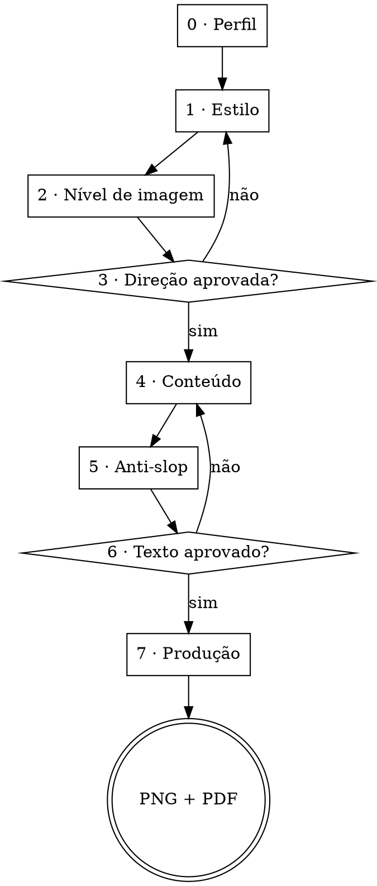

# Carrossel

Carrossel de feed com arte-final. **Toda tipografia é renderizada em HTML/CSS e capturada em PNG.** Modelo de imagem entra só onde não há palavra a ler.

Tudo de que a skill precisa está dentro dela. Nada aqui depende de outra skill estar instalada — ver [CREDITOS.md](CREDITOS.md).

## Os três princípios

**1. Modelo de imagem erra letra — e erra o acento primeiro.** Nenhuma palavra que o leitor vai ler sai de gerador de imagem. Nem o título, nem a paginação, nem o arroba. Não é preferência de qualidade: é a diferença entre entregar e refazer.

**2. Desenhar vem antes de gerar.** A maior parte do que um carrossel precisa — grade, blocos, ícones, abstração de interface, diagrama, tabela — se desenha em HTML/CSS/SVG com controle total e custo zero. **Interface desenhada em blocos ganha de print com filtro aplicado.** O gerador entra no que não se desenha: retrato, cena, textura, colagem. Ver [references/grafismos.md](references/grafismos.md).

**3. Nada avança sem aprovação.** Oito etapas com trava entre elas. Refazer oito cards renderizados custa muito mais do que uma pergunta.

## O fluxo



**A etapa 2 já foi "1.5" e era pulada em toda sessão de teste.** Meio número lê como
observação de rodapé de uma etapa que acabou; a etapa 1 terminava mostrando arte, o usuário
aprovava a direção e ninguém voltava para perguntar de imagem. Ela é uma etapa inteira, com
trava, e o `exportar.sh` para se a decisão dela não estiver gravada.

O protocolo de como perguntar — uma por vez, múltipla escolha, trava a cada bloco — está em [references/texto.md](references/texto.md). Este arquivo diz *o quê* e *em que ordem*.

## Três regras de conversa que valem o fluxo inteiro

### O usuário vê o carrossel dele uma vez: pronto

**Não existe preview antes da etapa 7.** Nem capa, nem card do meio, nem "um teste rápido para
você ver a direção". A primeira arte com o assunto dele que chega ao usuário é a arte final,
com o texto aprovado, o nível de imagem já decidido e os cards todos montados.

Isso não é economia de rodada, é o oposto: **preview cedo custa rodadas.** Ele chega antes do
nível de imagem, então mostra uma versão que nem sequer é a que vai ser produzida — desenhada
em código quando a decisão vai ser gerador, ou o contrário. O usuário opina sobre uma peça
descartável, o texto ainda é provisório, e metade dos comentários é sobre palavra que já ia
mudar. Duas vezes em teste a conversa parou para discutir um card que não existiria.

**A escolha de estilo não precisa de render** — para isso existem as 21 referências fixas em
`assets/referencias/`, que são imagens de verdade e mostram o estilo em três arquétipos de
layout. Escolhe-se olhando aquilo.

### Nunca pergunte duas vezes a mesma coisa

Na etapa 0 você já ficou sabendo: **quem assina, onde publica, o assunto e quantos cards.**
Nada disso se pergunta de novo mais adiante. Se precisar confirmar, **afirme e peça o aceite**
— "são sete cards, certo?" — nunca "quantos cards você quer?". Repetir a pergunta faz parecer
que você não estava prestando atenção, e é a queixa mais comum de quem testa a skill.

Antes de perguntar qualquer coisa, releia o que já foi dito na conversa. Se a resposta está lá,
use.

### Fale como quem explica para um cliente, não para outro programador

A pessoa do outro lado quer um post bonito. Ela não precisa saber como a peça é feita.

| não diga | diga |
|---|---|
| "vou renderizar em HTML/CSS e capturar via headless" | "vou montar a arte e te mostrar" |
| "aplicando duotone com mapeamento de rampa na paleta" | "vou deixar a foto nas cores do estilo" |
| "o corpo está com 30px, abaixo do piso" | "o texto ficou pequeno demais para o feed, vou subir" |
| "gerando o gabarito para extrair as coordenadas" | *não diga nada — isso é trabalho interno* |
| "detectei conflito na área de segurança" | "isso ia sumir no corte do LinkedIn, arrumei" |

**Etapa intermediária não se narra.** Gabarito, medição, teste de fonte, chapa limpa: some com
tudo. Quem pede um carrossel quer ver o carrossel.

E quando algo der errado, diga **o que ficou ruim e o que você vai fazer** — não o nome técnico
do defeito.

---

## Etapa 0 — Perfil

Leia `~/.claude/carrossel-perfil.md`. **Se existir**, mostre um resumo de três linhas e pergunte só o que muda neste trabalho. **Se não existir**, faça a conversa de setup e grave ao final.

**Há um terceiro estado, e ele é pedido com frequência:** *"esquece o que está salvo, faz como
se eu fosse novo"*. Quem acabou de instalar a skill quer testá-la na própria máquina, e o
perfil dele atrapalha o teste. Nesse caso rode o setup inteiro e **não leia o arquivo** — mas
**não sobrescreva nem apague o arquivo real**, e ao fim pergunte se o resultado deve substituir
o que estava lá. Se ele disse "ignore o gerador conectado" junto, trate como quem nunca
conectou nada: as opções sem conexão vão na conversa como se fossem as únicas.

As perguntas estão em [references/perfil.md](references/perfil.md), em três rodadas curtas e **sem jargão**. Elas cobrem: quem assina e onde publica, se há identidade de marca fechada, e se o usuário quer gerar imagem ou desenhar tudo.

Antes de propor estilo você precisa saber também: **o assunto e quantos cards**. Sem isso não dá para testar se uma direção escala.

## Etapa 1 — Estilo

São **sete, fixos**, especificados em [references/estilos.md](references/estilos.md) com paleta em hex, par tipográfico, material e o cuidado verificado de cada um:

| | Estilo | Em uma linha |
|---|---|---|
| 1 | **Brutalista vetorial** | forma chapada de aresta dura sobre papel cru, tipografia condensada como material |
| 2 | **Risografia com textura** | duas tintas que se multiplicam, erro de registro, retícula e fibra |
| 3 | **Terminal** | paleta de editor de código sobre off-white, grade de caractere e muito vazio |
| 4 | **Mixed media / colagem** | camadas de origens diferentes, toda emenda à mostra |
| 5 | **Neo-brutalismo colorido** | contorno preto grosso e sombra dura sobre campo saturado |
| 6 | **Minimalista editorial quente** | duas colunas, serifa de contraste alto, e muito vazio |
| 7 | **Iridescente minimal** | campo chapado que troca de cor a cada card, uma forma grande, centralizado |

**Não descreva os sete e peça para escolher.** Ninguém escolhe direção visual lendo adjetivo.
Cada estilo tem três referências fixas em `assets/referencias/` — `<estilo>-1-split.jpg`,
`-2-cascata.jpg`, `-3-bento.jpg` — e são elas que vão para o usuário, abertas com `open`, não
descritas. São três porque uma capa bonita não prova nada: o que quebra no card 5 é o estilo
não ter três arquétipos de layout, e as três referências mostram justamente isso.

**E para por aí.** Nada é renderizado com o assunto dele nesta etapa — a regra do preview está
lá em cima e vale aqui em primeiro lugar. Se ele ficar dividido entre dois estilos, mostre as
seis referências dos dois lado a lado e pergunte qual dos dois mundos é o dele; não desempate
com arte que vai ser jogada fora.

Duas coisas ditas **na hora da escolha**, não depois:

- **Se houver gerador conectado**, dois estilos mudam de patamar — risografia e colagem —, e a capa passa a receber imagem gerada sempre. Se não houver, quatro deles ficam completos assim mesmo
- **O neo-brutalismo colorido tem prazo de validade.** É o visual mais usado em post de design hoje: acerta fácil e envelhece rápido. Isso muda a decisão, então é informação de antes

Para a régua de gosto — escala, respiro, o que faz uma peça parecer cara e o que a faz parecer gerada por IA — use [references/visual.md](references/visual.md).

## Etapa 2 — Nível de imagem

> **Esta pergunta é obrigatória e tem três opções.** Nenhuma linha de arte é escrita antes da
> resposta. Se você chegou na etapa 4 e não sabe dizer se este trabalho é 1, 2 ou 3, você pulou
> uma etapa — volte e pergunte, mesmo que pareça tarde.

**O erro que se repete não é esquecer a pergunta, é reduzi-la a duas opções.** Em três testes
seguidos o meio sumiu: ou "tenho gerador conectado, gero tudo", ou "não tenho, desenho tudo em
código". **Banco de imagem aberto é a terceira, não conecta nada, e é a resposta certa para
metade dos assuntos** — quem tem tema fotografável e nenhuma conta de gerador cai exatamente
ali. Perguntar "quer gerar imagem ou desenhar?" é a pergunta errada, e é a que sai sozinha.

Pergunte pelo **resultado**, não pelo que a pessoa tem instalado. Ela escolhe o que quer e
depois descobre o que aquilo exige — o contrário faz escolher no escuro. E nada de "MCP",
"API" ou "nível A": ninguém que nunca conectou nada sabe o que é isso.

◇ **Como você quer as imagens do carrossel?**

| | Opção | O que você ganha | O que precisa |
|---|---|---|---|
| 1 | **Feitas sob medida** | o card inteiro é composto pelo gerador e a tipografia entra por cima, limpa | uma conta num gerador de imagem, ligada aqui. Te ajudo |
| 2 | **De banco grátis** | fotos e ilustrações de sites abertos, tratadas nas cores do estilo | nada. Já funciona |
| 3 | **Sem foto nenhuma** | tudo desenhado em código, nas cores exatas | nada. Já funciona |

Três coisas ditas junto, em uma linha cada:

- **Só a 1 responde ao seu assunto.** Nas outras duas você usa o que existe
- **A 3 não é a versão pobre.** Em brutalista, terminal, neo-brutalismo e iridescente o desenho costuma
  ficar melhor que foto, porque nasce já nas cores certas
- **A 2 depende do tema dar foto.** Relacionamento, viagem, comida, trabalho manual: rende.
  Um método, um conceito, uma ferramenta: não existe foto disso, e aí a 3 ganha

### Se escolheu a 1

◇ **Você já tem conta em algum gerador de imagem?**

Diga a verdade **antes** de tentar, porque metade dos casos não conecta:

| conta | dá para ligar? |
|---|---|
| **Gemini** | sim, e é o mais fácil. A chave é grátis |
| **ChatGPT Plus ou Pro** | **a assinatura não serve.** O acesso automático é cobrado à parte |
| **Higgsfield, Magnific** | sim, pelos conectores. Gasta crédito da assinatura |
| **Midjourney** | não dá para ligar. Mas dá para gerar por lá e me entregar o arquivo |

Essa última linha vale para qualquer conta que não conecte: **gerar na mão e entregar o
arquivo funciona.** Não é o ideal, é melhor do que desistir da imagem.

Não tendo conta nenhuma, ofereça a 2 ou a 3 — não empurre assinatura.

O passo a passo de cada ligação está em [references/geradores.md](references/geradores.md).
Em todos: **a chave nunca é colada no chat** — o que passa por aqui fica registrado. A pessoa
guarda no computador dela e responde só "pronto". A skill grava o fato,
`gemini: chave configurada em AAAA-MM-DD`, nunca o valor.

### Se escolheu a 2

**Dupe** e **Openverse**, nesta ordem, e a busca é por **assunto — nunca por estilo**: quem
busca "minimal aesthetic" traz foto de banco com a paleta por cima, que é o defeito. O estilo
entra depois, no tratamento. A regra inteira, com os filtros de licença e o tratamento por
estilo, está em [references/grafismos.md](references/grafismos.md#banco-de-imagem--se-buscar-assunto-nunca-estilo).

Uma coisa dita agora, não na entrega: **o banco não responde ao seu assunto, ele responde ao
que existe.** Se as buscas voltarem fracas, a saída é a 3 naquele card — desenho em código —, e
isso se diz na hora, não se disfarça com foto quase certa.

### Se escolheu a 3

Nada a ligar. Vá para [references/grafismos.md](references/grafismos.md), que é o repertório do
que se desenha: grade, blocos, diagrama, abstração de interface, ícone, tabela.

## Etapa 3 — Aprovação da direção

Não avance sem resposta explícita.

Se o usuário pedir **mistura de dois estilos**, não renderize um teste — a regra do preview vale
aqui também. Resolva por escrito, que é mais rápido e mais claro: diga **qual dos dois manda em
cada camada** — paleta, tipografia, material, grafismo —, porque estilo misturado quebra
justamente quando as duas disputam a mesma camada. Feche isso no `DIRECAO.md` e siga.

Ao fechar, registre em `DIRECAO.md` na pasta do trabalho: paleta em hex com o uso de cada cor,
fontes com nome de arquivo, lógica de grade, e como cada tipo de card se comporta.

**Registre o nível de imagem numa linha própria, com este formato exato** — o `exportar.sh` lê
essa linha, e **para se ela não existir**:

```markdown
imagem: 1 · higs / nano_banana_pro
imagem: 2 · dupe + openverse
imagem: 3 · só desenho em código
```

O número é o da etapa 2, e a linha é a prova de que a etapa aconteceu. Sem ela a etapa 7 não
sabe que existe gerador ligado e monta pelo caminho de quem não tem — foi assim que um
Higgsfield conectado terminou sem laço de gabarito nenhum. Os arquivos do laço ficam como
`gabarito-NN.png` e `chapa-NN.png`.

**Cheque os acentos antes de fechar.** Os pares dos sete estilos já foram conferidos glifo a glifo. Mas se o usuário trouxe fonte de marca, renderize `ÁÀÂÃÉÊÍÓÔÕÚÜÇ áàâãéêíóôõúüç` e olhe — o navegador troca só o glifo faltante por outra fonte, o que é pior do que quebrar, porque passa despercebido. Faltando: troque a fonte, ou use **`abrasileirar-fonte`** para desenhar os acentos no traço da própria fonte.

## Etapa 4 — Conteúdo

**Três perguntas, e só.** Escrever card a card não é trabalho do usuário — é da `carousel-writer-sms`, embutida em [references/texto.md](references/texto.md). A entrevista define *o que* e *como* dizer ao longo do carrossel, não arranca o texto pronto dele.

Uma por vez:

◇ Qual é sua tese — a única coisa que o leitor tem que levar embora?
◇ Como termina? (comentar · salvar · seguir · instalar · outro)
◇ Tem algum dado seu, número ou história, que só você poderia contar?

▸ Com isso, **proponha o mapa dos cards**: uma sinopse de uma linha por card, numerada, mais o gancho da capa. Não é o texto final, é o roteiro — e é sobre ele que o usuário opina.

◇ O mapa fecha assim?

Só depois do mapa aprovado o texto é escrito de verdade.

**Por que nesta ordem:** discutir o mapa custa uma rodada; descobrir na etapa 6 que o carrossel conta a história errada custa todas. E sete linhas de roteiro se julgam melhor que sete blocos de texto acabado, onde a redação disputa atenção com a estrutura.

A regra que vale em qualquer plataforma: **um card = uma ideia**. Essa não cede nunca.

**O tamanho do corpo, sim.** As 25 palavras são a régua do Instagram; o LinkedIn aceita
profundidade, e quando o usuário marca os dois destinos as duas regras se contradizem. Quem
ganha:

- **Marcou só Instagram** → 25 palavras, e se não coube são dois cards
- **Marcou LinkedIn, com ou sem Instagram** → o teto passa a ser **físico, não editorial**:
  o corpo cresce até onde a zona do grafismo começaria a ser esmagada, e quem diz onde é isso
  é o `?medir=1`, não a contagem. Costuma dar o dobro
- **Assunto que exige traduzir termo** — "função executiva", "externalidade", qualquer coisa
  que o público não tem — **entra no segundo caso mesmo em post só de Instagram.** Cortar a
  tradução para caber na régua entrega um card que não explica nada, e a crítica que volta é
  "está superficial"

E há uma saída que não custa card nem palavra do corpo: **em terminal, colagem e neo-brutalismo
o grafismo carrega texto de verdade.** A definição do conceito vai para dentro da janela, da
tira de papel ou do balão, e o corpo continua sendo só o argumento. É como se tem o dobro de
conteúdo sem perder "uma ideia por card" — e o que vai ali é conteúdo aprovado na etapa 4, o
que mantém a regra do grafismo mudo de pé.

## Etapa 5 — Anti-slop

**Só texto.** Capa, corpo, CTA, legenda e alt text. Está embutida em [references/anti-slop.md](references/anti-slop.md), com os arquivos em `references/anti-slop/`. Não precisa instalar nada.

**A revisão de slop gráfico saiu daqui.** Ela produzia texto genérico para descrever problema visual — o oposto do que esta etapa existe para fazer. O que é visual se resolve olhando o PNG na etapa 7, com a checagem antipadrão.

**Obrigatório antes de mostrar qualquer texto ao usuário.**

Se você passou o texto e não cortou nada, você não aplicou. Volte e aplique.

**Grave o registro dos cortes no arquivo, não na resposta.** No momento em que o usuário precisa julgar o texto, a memória de cálculo atrapalha. A única exceção é um corte que atropelou o que parecia escolha deliberada de voz — esse você aponta, em uma linha, para ele decidir.

## Etapa 6 — Aprovação do texto

Mostre os cards numerados, a legenda e o alt text, **limpo** — sem justificar o que foi cortado.
Texto, em texto: não monte arte para mostrar texto, nem "só a capa para dar uma ideia".

**Diga isto, com estas palavras ou parecidas:**

> Os textos estão em `TEXTOS.md`, na pasta do trabalho. **Se quiser mudar qualquer palavra, edita
> direto lá e me avisa aqui** — eu regero a arte a partir do arquivo. Você não precisa mexer em
> código nem descrever a alteração no chat.

Isso não é conveniência, é a diferença entre uma rodada e cinco. Descrever alteração de texto por
chat é lento e impreciso; abrir o arquivo e digitar é imediato. E **só funciona se a arte ler o
`.md` de verdade** — o padrão está em [references/montagem.md](references/montagem.md). Se você
embutiu o texto no HTML, a promessa é falsa e o usuário vai descobrir na primeira correção.

Ofereça **uma capa alternativa**. A capa é o único card que decide se os outros sete existem.

## Etapa 7 — Produção

Agora, e só agora, monte a arte — e esta é a **primeira e única vez** que o usuário vê a peça
dele. O manual técnico completo — esqueleto, captura, área de segurança, PDF e as armadilhas que
custam tempo — está em [references/montagem.md](references/montagem.md).

**Três coisas existem antes de você escrever a primeira linha de arte.** Se faltar qualquer uma,
a etapa que a produz foi pulada:

| | existe? | quem produz |
|---|---|---|
| `DIRECAO.md` com a linha `imagem: N` | senão o `exportar.sh` para | etapas 2 e 3 |
| `TEXTOS.md` com o texto aprovado | senão a arte é chute | etapas 4 a 6 |
| número de cards confirmado | senão a grade não fecha | etapa 0 |

### Antes do passo 1: há gerador ligado?

**Se a etapa 2 fechou na opção 1, a produção é outra.** Não comece pelo esqueleto — comece
pelo **laço do gabarito**, em [references/geradores.md](references/geradores.md#o-laço-do-gabarito--quando-há-gerador-conectado).
Este é o erro que já aconteceu em produção: o gerador foi conectado, a skill gerou ilustração
solta e montou como se não houvesse gerador nenhum. **Conectar e não rodar o laço desperdiça a
única coisa que o nível 1 compra.**

O laço, em uma linha cada — os cinco passos completos estão no arquivo:

1. **Gera o card inteiro, com título e sub.** O texto no prompt não é para usar: é para o modelo
   ter o que diagramar. Sem texto ele devolve ilustração, não cartaz
2. **Mede a chapa.** É esta a entrega da etapa — ela sobrevive mesmo que a imagem seja jogada fora
3. **Acha a fonte open-source mais próxima**, pela régua de três medidas
4. **Refaz sem texto**, passando a primeira geração como **mídia de referência** — gerar do zero
   devolve outra composição e o gabarito se perde
5. **Monta o HTML por cima**, com o texto vindo do `TEXTOS.md`

Duas coisas que decidem se o laço fecha, e ambas moram no prompt da geração: as **três zonas
declaradas**, sem as quais a chapa nasce cheia e nenhuma montagem é possível; e a **âncora de
referência**, gerar a capa primeiro e passá-la nos outros cards, sem a qual saem cartazes primos
em vez de irmãos.

Depois do laço, a montagem segue os passos abaixo normalmente — o esqueleto continua sendo a
mecânica, com a chapa entrando como fundo e as coordenadas medidas mandando no tipo.

1. Copie `assets/esqueleto.html` para a pasta do trabalho e aplique a direção aprovada. **O HTML lê `TEXTOS.md`; ele não guarda texto**

   **Copie e troque valores. Não reescreva o CSS do zero.** Parece mais rápido escrever um
   arquivo limpo com a direção já aplicada, e é onde a produção quebra: o esqueleto carrega
   propriedades que não parecem importantes e são estruturais — `white-space:nowrap` no `.tt`,
   que impede o título de quebrar sozinho, e `overflow:hidden` no `.gfx`, que é o que faz o
   empilhamento valer para elemento posicionado em absoluto. Quem reescreve perde as duas e
   descobre depois de capturar, olhando. **Mude cor, fonte, tamanho e composição; a mecânica
   fica.** Vale o mesmo para os scripts: `exportar.sh` já traz o laço de captura, a checagem de
   erro de JS e a conferência dos PNGs. Reimplementar isso custa as armadilhas de novo
2. `assets/baixar-fontes.sh <estilo>` gera o `fonts.css` com as faces embutidas
3. `assets/exportar.sh` captura os PNGs em 1080×1350 e monta o PDF
4. **Abra cada PNG e olhe.** Captura falha em silêncio: sai arquivo do tamanho certo, em branco
5. Passe a checagem antipadrão abaixo

**Apresente o resultado ao usuário, não o caminho da pasta.** Mandar alguém abrir um diretório
para ver o próprio trabalho é a pior parte de uma entrega boa.

**Mas confirme que ele viu.** Abrir um PNG com a ferramenta de leitura mostra a imagem **para
você, não para ele** — em várias superfícies isso não chega do outro lado, e a etapa vira uma
pergunta de aprovação sobre uma imagem invisível. Aconteceu em produção: a folha de contato foi
montada, descrita e submetida à decisão, e a resposta foi *"não estou vendo as gerações, onde
estão?"*. Uma rodada inteira queimada.

As rotas, em ordem:

| | Rota | Quando |
|---|---|---|
| 1 | `open <arquivo>` | qualquer superfície local. **É o padrão seguro** — abre no visualizador do sistema, e o arquivo aparece sem ninguém procurar pasta |
| 2 | artefato publicado | onde essa capacidade existir. Melhor para folha de contato, porque o usuário navega |
| 3 | imagem na mensagem | só onde a superfície de fato renderiza para quem lê |

Isso vale nas **duas** vezes em que imagem sai daqui: as referências fixas da etapa 1 e a arte
da etapa 7. Nas duas, **mostre e só então pergunte** — nunca as duas coisas na mesma mensagem
sem saber se a imagem chegou.

### O artefato só aparece com a arte pronta

**Etapa intermediária não vai para o usuário.** Gabarito, chapa limpa, medição, teste de fonte — tudo isso é trabalho seu. O que chega é o carrossel montado, com o texto já aplicado como sugestão final.

Mostrar o caminho parece transparência e é ruído: o usuário passa a opinar sobre uma imagem que vai ser jogada fora, e você gasta uma rodada explicando por que ela não é a peça.

Junto com o artefato, o aviso do `TEXTOS.md` da etapa 6 — e a parte que faz diferença dita explicitamente: **o corpo se reajusta ao espaço já reservado em cada card, então mudar uma palavra não desmancha a diagramação.**

### Formatos

| Destino | Arquivo | Observação |
|---|---|---|
| Instagram | PNG 1080×1350 (4:5) | um por card |
| LinkedIn | PDF sequencial **1080×1080** | o corte 1:1 central do mesmo PNG — ver abaixo |
| Stories | PNG 1080×1920 | só se pedirem |

**O PDF do LinkedIn é quadrado, e sai do próprio PNG vertical:** recorte cada card em `y=135..1215`
e monte o PDF com os recortes. Não rediagrame nada.

**Mas o recorte só funciona se a margem já estiver dentro dele.** Foi assim que a queixa apareceu:
*"a versão do LinkedIn está virando só um crop, o texto fica sem respiro em cima e embaixo"* —
e estava certa. O card tinha sido diagramado com margem contada a partir da borda de 1350, então
o corte comia a margem inteira e entregava texto colado no topo da página. A área viva de
924×924 abaixo existe por causa disso: **a margem do quadrado se reserva na diagramação, não na
exportação.**

Se algo essencial sumiu no corte, ou ficou espremido nele, o erro está na diagramação do card.

```python
sq = [Image.open(p).crop((0, 135, 1080, 1215)) for p in pngs]
sq[0].save('linkedin-1080.pdf', 'PDF', resolution=150, save_all=True, append_images=sq[1:])
```

O feed do LinkedIn é largo e reduz o documento: o piso geral de corpo é **30px** sobre 1080, e
**34px** quando o LinkedIn é o destino principal.

### Área de segurança — obrigatória, sempre

**A área viva é um quadrado de 924×924 no centro do card** — `x 78..1002`, `y 213..1137`. Todo
texto mora ali dentro, **inclusive o pé**. Fora dela, até a borda, é sangria: grafismo entra,
texto não.

```
1080×1350  ┌──────────────────────────┐
           │      sangria · 135       │   grafismo pode entrar
    y=135  ├──────────────────────────┤ ← corte 1:1: a PÁGINA do LinkedIn
           │  ┌────────────────────┐  │
           │  │                    │  │
    y=213  │  │   924 × 924        │  │ ← área viva: todo o texto, e o pé
           │  │   x 78..1002       │  │
           │  │                    │  │
   y=1137  │  └────────────────────┘  │
   y=1215  ├──────────────────────────┤
           │      sangria · 135       │
           └──────────────────────────┘
```

**Por que 213 e não 135 em cima e embaixo.** Porque o corte 1:1 não é um recorte de emergência:
**é a página do LinkedIn**, e página tem margem. Encostar o texto em y=150 dá 165px de folga no
Instagram e **15px** no LinkedIn — o card sai apertado lá, e não há nada a fazer na exportação
porque o problema nasceu na diagramação. A margem tem que estar dentro do corte.

Repare que a área viva é **quadrada e do tamanho da largura útil**: os mesmos 924 nos dois eixos,
com 213 de sangria em cima e embaixo. Diagramando ali, os dois formatos saem certos do mesmo
arquivo — o vertical ganha respiro extra, o quadrado tem a margem que precisa, e nenhum dos dois
foi rediagramado.

O esqueleto traz o gabarito: `?card=N&safe=1` desenha o corte em vermelho e o quadrado vivo em
verde.

---

## Padrões de composição

**A capa tem título dominante.** A razão entre o título e o subtítulo é de pelo menos **2,5:1**. Título grande, sub pequeno, e nada mais — sem eyebrow, sem rodapé, sem rótulo, a menos que carreguem informação que o leitor precisa.

**Slot vazio não se preenche, se elimina.** Se o template criou uma caixa e você precisou inventar texto para ela, a caixa sai e o vazio vira respiro. Ver a auditoria de slots em [references/anti-slop.md](references/anti-slop.md).

**O grafismo é mudo.** Se você desenhou algo e precisou escrever um rótulo para ele se explicar, o problema é o desenho. Texto dentro de grafismo só é legítimo se veio da etapa 4, aprovado, ou se é dado duro e verdadeiro.

**Ritmo por arquétipo.** Os três arquétipos de layout — editorial split, cascata Z, bento assimétrico — entram em rodízio ao longo do carrossel. Oito cards no mesmo arquétipo viram oito paredes iguais.

**Havendo gerador conectado, todos os cards nascem de gabarito gerado** — não só a capa. O laço
está na etapa 7. A capa é o piso, não o teto: se o crédito for curto, gere a capa e o fecho e
desenhe o miolo, mas diga isso ao usuário com o número de créditos, não decida em silêncio.

Duas regras sobre essa imagem, ambas em [references/grafismos.md](references/grafismos.md):

- **O assunto vem do tema, não do estilo.** O teste da troca reprova imagem que só combina com a paleta
- **A especificação do estilo vai no prompt.** Paleta em hex, idioma visual, material e proibições — o gerador devolve a peça já na linguagem. Foto neutra tingida com duotone depois lê como foto tingida, não como peça da direção. E se a imagem já veio na paleta, **tire o duotone do CSS**: ele achata o acento

## Hierarquia quando algo não couber

Sacrifique nesta ordem, **de baixo para cima**:

1. **Leitura** — nunca cede. Corpo sobre papel sólido, tamanho que se lê no feed
2. **Respiro** — cede pouco. Vão vazio é composição, não desperdício
3. **Grafismo** — cede primeiro. Encolhe, corta, ou sai

Texto sobrepondo grafismo é falha estrutural, não ajuste fino. Resolva com empilhamento rígido — cabeça, texto, grafismo, pé — onde o texto reserva a altura de que precisa e o grafismo fica com o que sobra. O esqueleto já é assim.

## Checagem antes de entregar

Se qualquer item aparecer na arte, ela lê como feita por IA genérica:

- [ ] Gradiente índigo → violeta, ou qualquer gradiente de dois roxos
- [ ] Vidro fosco: card translúcido com blur e borda branca de 1px
- [ ] Blob 3D, esfera de vidro, forma orgânica renderizada
- [ ] Glow neon atrás de texto ou forma
- [ ] Ícone dentro de tile pastel arredondado
- [ ] Sombra gigante e difusa embaixo de tudo
- [ ] Layout de landing de SaaS: hero centralizado e três cards iguais
- [ ] Emoji como elemento gráfico
- [ ] **Texto legível vindo de modelo de imagem**

E mais:

- [ ] Todos os PNGs abertos e olhados, um a um
- [ ] **Nenhum texto coberto — nem por grafismo, nem por outro grafismo.** Em terminal, colagem
      e em qualquer cascata os elementos se sobrepõem por projeto: o que come letra ali não é o
      texto do card sobre o desenho, é um elemento do desenho sobre o texto de outro
- [ ] Nada essencial fora do quadrado vivo de 924×924 — e **olhe o PDF quadrado**, não só o PNG:
      é lá que a falta de margem aparece
- [ ] Nenhum corte ou overflow — confira também os 8px finais de cada PNG
- [ ] Print de app real revisado por dado pessoal: nome, e-mail, cliente, token
- [ ] Acentos conferidos, se entrou fonte de fora dos sete estilos
- [ ] Ritmo: passando os cards em sequência, algo muda de posição ou escala
- [ ] Alt text escrito, um por card
- [ ] Legenda passou pela mesma régua anti-slop

## Red flags — pare e volte uma etapa

Estes pensamentos aparecem quando o usuário diz "tenho pressa". Todos custam mais tempo do que economizam.

| O que você vai pensar | O que é verdade |
|---|---|
| "Com pressa, conversa de setup é hostil" | Roda uma vez e fica salva. Errar a lista invalida os oito cards |
| "Descrevo os sete estilos, ele escolhe pelo nome" | Ninguém escolhe direção visual lendo. Abra as três referências fixas do estilo |
| "Adianto a arte enquanto ele responde o texto" | Arte nenhuma existe antes da etapa 7. Nem para adiantar, nem para ilustrar a conversa |
| "Meu default escuro com acento neon é bonito e seguro" | É exatamente o visual que hoje lê como IA. Seguro e indistinguível são a mesma coisa |
| "Renderizo uma capa rápida só para ele ver a direção" | Ela vem antes do nível de imagem: mostra uma peça que não é a que será produzida. E o texto ainda é provisório, então metade do que voltar é sobre palavra que já ia mudar |
| "Ele tem conector ligado, então é nível 1 — não preciso perguntar" | Ter conector não é querer gastar crédito neste post. A pergunta é sobre o resultado, e as três opções vão inteiras |
| "Não tem gerador, então é tudo desenhado em código" | Faltou o meio. Banco aberto não conecta nada e é a resposta certa quando o tema dá foto |
| "O gerador acertou a letra dessa vez" | Acertou nessa geração. Não vai acertar nas oito. E o acento é onde ele erra primeiro |
| "Gero a imagem e ajusto o texto pra caber" | O texto passa a servir a imagem. Inverte a peça inteira |
| "Isso é fácil de desenhar, gero mais rápido" | Gerar custa uma rodada de prompt, uma de download e uma de recorte. Um `<div>` custa uma linha |
| "Depois eu olho os PNGs" | Captura falha em silêncio. Olhe antes de entregar, um por um |
| "Mando a pasta e ele abre" | Entrega é o que ele vê, não o que ele encontra |
| "Tenho gerador ligado, gero as ilustrações e monto" | Gerar ilustração solta é o nível 2 pagando preço de nível 1. Com gerador, o card inteiro nasce dele e a letra entra por cima — é o laço do gabarito |
| "Gero o card sem texto, que é o que eu quero no fim" | Sem texto no prompt o modelo devolve ilustração, não cartaz. O texto da primeira geração é descartável; a composição dele é o produto |

## Sobre disparar agentes

**Faça tudo aqui, em sequência.** Subagente não pergunta nada ao usuário, e a premissa desta
skill é perguntar tudo — as etapas 0, 2, 3 e 6 são indelegáveis por natureza, e a 7 é o laço de
renderizar, olhar e ajustar com o usuário no meio, onde um agente só adiciona ida e volta e
perde o contexto visual.

O único caso que já compensou — renderizar previews de vários estilos em paralelo — **deixou de
existir**: não há mais preview de estilo. Sobra zero. Se o usuário pedir agente explicitamente,
é escolha dele; nunca é padrão.

## Onde delegar

| Situação | Vá para |
|---|---|
| Revisar texto que já existe, fora de carrossel | `sprayantislop` ou `deslopar` |
| Fonte de marca sem acento em pt-BR | `abrasileirar-fonte` |
| Peça única, não swipeable | `post-writer-sms` |
| Só a legenda do post | `caption-writer-sms` |

O que é só desta skill: a ordem das oito etapas, os sete estilos fechados, o desenho antes da geração, e a montagem em código.
