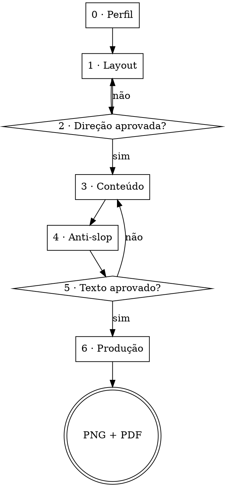

# Carrossel

Carrossel de feed com arte-final. **Toda tipografia é renderizada em HTML/CSS e capturada em PNG.** Modelo de imagem entra só onde não há palavra a ler.

## Os três princípios

**1. Modelo de imagem erra letra — e erra o acento primeiro.** Nenhuma palavra que o leitor vai ler sai de gerador de imagem. Nem o título, nem a paginação, nem o handle. Isso não é preferência de qualidade: é a diferença entre entregar e refazer.

**2. Desenhar vem antes de capturar, que vem antes de gerar.** A maior parte do que um carrossel precisa — grade, blocos, ícones, abstração de interface, diagrama, tabela — se desenha em HTML/CSS/SVG com controle total e custo zero. **Interface desenhada em blocos ganha de print com filtro aplicado**: nasce na paleta certa, mostra só o que interessa, e nenhum dado real vaza. O print só entra quando o valor do card está em provar como a tela é de fato. O gerador entra por último, quando o card pede retrato, cena ou textura que não se desenha. Ver [references/grafismos.md](references/grafismos.md).

**3. Nada avança sem aprovação.** São seis etapas com trava entre elas. Refazer oito cards renderizados custa muito mais do que uma pergunta.

## Antes de começar

Invoque **`using-superpowers`** para saber como localizar e usar as skills irmãs, e **`brainstorming`** para conduzir a conversa de decisão. Este arquivo diz *o que* perguntar e *em que ordem*; o `brainstorming` diz *como* perguntar — uma coisa por vez, múltipla escolha quando der, aprovação a cada bloco.

## O fluxo



---

## Etapa 0 — Perfil

Leia `~/.claude/carrossel-perfil.md`. **Se existir**, mostre um resumo em três linhas e pergunte só o que muda neste trabalho. **Se não existir**, faça a entrevista de setup e grave o arquivo ao final.

As perguntas do setup, o formato do arquivo e a pergunta sobre MCPs estão em [references/perfil.md](references/perfil.md). Em resumo, o setup cobre: quem assina e onde publica, identidade visual disponível (fontes instaladas, paleta, logo), voz e público, e **quais geradores de imagem o usuário tem** — Pollinations é o padrão e sempre funciona; Higgsfield e Magnific entram se ele tiver conta e os MCPs conectados.

Antes de propor layout, você precisa saber também: **o assunto do carrossel e quantos cards**. Sem isso não dá para testar se uma direção escala.

## Etapa 1 — Layout

O usuário tem três caminhos, e você oferece os três:

- **Anexar referências** — ele manda imagens. Você lê cada uma e devolve o que extraiu: paleta em hex, tipo de tipografia, lógica de grade, textura, o que dá para reproduzir em CSS e o que não dá.
- **Descrever** — ele diz em palavras. Você traduz em especificação concreta e devolve para conferência antes de produzir.
- **Não saber por onde começar** — você propõe **cinco direções que discordam entre si**, partindo da [biblioteca visual](references/biblioteca-visual.md): dezoito referências em `assets/referencias/`, cada uma descrita pelo **mecanismo de composição**, com paleta em hex e par de fontes open-source.

**A biblioteca é filtrada pelo que o usuário tem, e isso precisa ficar claro para ele:**

| Sem gerador | Com Pollinations, chave de API ou MCP |
|---|---|
| **9 estilos** — Bauhaus, Brutalismo, Pop Art, Utilitário, Mid-Century, Neo-Brutalismo, Suíço, Memphis, Janelas | **os mesmos 9 + 7** — Vaporwave, Pontilhismo, Mixed Media, Kawaii, Wabi Sabi, Rebus, Y2K |
| tudo desenhado em CSS, custo zero | os 7 extras pedem retrato, cena ou textura |

Diga isso ao usuário na etapa 0, com o número: conectar um gerador **libera 7 estilos além dos 9**. É a única forma de ele decidir se vale o esforço de conectar. Nunca proponha um dos 7 para quem não tem gerador — a direção é aprovada e você trava na etapa 6.

Dois estilos estão marcados como proibidos na biblioteca: estão lá para você reconhecer, não para propor.

O defeito a evitar tem nome: cinco direções que trocam de cor e continuam sendo a mesma composição — tipografia grande no topo, um fio, corpo abaixo, elemento no pé. Isso é uma direção com cinco roupas, e o usuário escolhe entre nada.

A trava contra isso: **antes de renderizar, escreva qual é o mecanismo de cada uma das cinco.** Grade visível, diagonal fora de eixo, janelas sobrepostas, placa de papel com invasão, cena que avança. Se dois mecanismos se repetirem, troque antes de gastar render. O teste de escala, que reprova direção bonita que só funciona na capa, está em [references/direcoes-de-layout.md](references/direcoes-de-layout.md).

Para a régua de gosto, puxe **`bencium-innovative-ux-designer`** e **`frontend-design`**. Elas cobrem escala tipográfica, espaçamento e o que faz uma peça parecer cara. Não reimplemente esse julgamento aqui.

**Entregue como preview real, não como descrição.** Renderize a capa e um card do meio de cada direção — é barato e é a única forma honesta de escolher. Avise, sempre: *o texto do preview é provisório; a decisão aqui é de direção visual*.

### Como mostrar o visual ao usuário

**Nunca mande o usuário abrir uma pasta.** Caminho de arquivo não é apresentação — é lição de casa. Ele precisa ver a arte no lugar onde está conversando com você.

Duas rotas, nesta ordem de preferência:

1. **Artefato** — publique uma página com as artes lado a lado, usando a ferramenta de Artifact. Miniaturas em JPEG embutidas em base64 (a página não carrega host externo), numeradas, com espaço para o usuário comparar. É a melhor rota quando são muitas peças ou quando ele vai querer voltar depois.
2. **Direto na mensagem** — quando forem uma ou duas peças, mostre na conversa mesmo.

Reduza a miniatura antes de embutir: 1080×1350 vira 540×675 em JPEG qualidade 80, o que derruba de ~2 MB para ~100 KB por peça. Sete peças cabem numa página leve.

Os PNGs em tamanho real continuam sendo gravados em disco — mas isso é entrega, não apresentação.

## Etapa 2 — Aprovação da direção

Não avance sem resposta explícita. Se o usuário pedir mistura de duas direções, produza a mistura e mostre antes de seguir — direções misturadas costumam brigar, e é melhor descobrir agora.

Ao fechar, registre a direção escolhida em `DIRECAO.md` na pasta do trabalho: paleta em hex com o uso de cada cor, fontes com nome real de arquivo, lógica de grade, e como cada tipo de card se comporta.

**As fontes vêm da biblioteca, não do acervo pessoal do usuário.** Cada estilo tem um par open-source definido — título e corpo — e o script baixa, confere os acentos e monta o `fonts.css`:

```bash
assets/baixar-fontes.sh utilitario     # baixa o par e gera fonts.css
assets/baixar-fontes.sh --listar       # os 16 estilos disponíveis
```

Isso não é preferência: carrossel montado com fonte que só existe na máquina de uma pessoa não é reproduzível por quem instalar a skill. As dezesseis famílias foram verificadas e todas têm acento pt-BR completo.

Se o usuário insistir numa fonte própria, cheque os acentos antes de fechar — fonte de display gringa costuma vir sem `ç`, `ã`, `õ`, `Ê`, e o navegador troca só o glifo faltante por outra fonte, o que é pior do que quebrar porque passa despercebido. Renderize `ÁÀÂÃÉÊÍÓÔÕÚÜÇ áàâãéêíóôõúüç` e olhe. Faltando: use **`abrasileirar-fonte`**.

## Etapa 3 — Conteúdo

Só agora. Pergunte, nesta ordem:

1. **O gancho da capa** — qual a promessa, e por que alguém pararia o dedo nela
2. **A tese** — o fio que liga todos os cards; sem isso vira lista solta
3. **Os passos** — um por card, uma ideia por card, sem exceção
4. **O fechamento** — qual ação, e o que o leitor ganha em fazê-la
5. **Onde ficam os links** — no card, na legenda, na bio, ou em vários

Para a estrutura por plataforma — quantos cards, quanto texto por card, o que vai na legenda — delegue a **`carousel-writer-sms`**. Ela já tem os limites do Instagram, LinkedIn, TikTok e Pinterest. Não duplique essas regras aqui.

Regra de tamanho que vale para qualquer plataforma: **um card = uma ideia**, e o corpo de texto cabe em 25 palavras. Se não coube, são dois cards.

## Etapa 4 — Anti-slop

**Obrigatório, antes de mostrar qualquer texto ao usuário.** Passe capa, corpo, CTA, legenda e alt text pela régua anti-slop, que **está embutida nesta skill** em `references/anti-slop/` — não precisa instalar nem clonar nada.

A ordem de aplicação, o que mais aparece em carrossel e como registrar os cortes estão em [references/anti-slop.md](references/anti-slop.md).

Isso não é revisão de fachada. Se você passou o texto e não cortou nada, você não aplicou a skill — volte e aplique.

## A conversa de aprovação e de edição

Vale nas duas travas — direção e texto. O usuário está julgando, não operando.

- **Mostre, não descreva.** Arte por artefato ou na mensagem; texto por extenso na resposta, card a card
- **Pergunte uma coisa por vez**, com opções concretas. "Aprova ou quer ajustar algum card?" resolve melhor que uma lista de dúvidas
- **Aceite edição em qualquer formato** — ele pode responder "troca o card 3 por X", editar o `.md` direto, ou dizer só "o 5 tá fraco". Se ele editou o arquivo, releia antes de seguir
- **Uma pergunta de cada vez, e siga.** Aprovação não é formulário

## Etapa 5 — Aprovação do texto

Mostre os cards numerados, a legenda e o alt text. **Só isso.**

Não justifique o que a régua cortou. O usuário quer ler o texto final, não a memória de cálculo — a lista de cortes é ruído no momento em que ele precisa julgar o resultado. Grave o registro no arquivo, para consulta, e mantenha a resposta limpa.

Exceção: se um corte atropelou algo que parecia escolha deliberada de voz, aponte **esse caso**, em uma linha.

Ofereça **uma capa alternativa**. A capa é o único card que decide se os outros sete existem.

## Etapa 6 — Produção

Agora, e só agora, monte a arte. O manual técnico completo — esqueleto HTML, captura, área de segurança, PDF e as armadilhas que custam tempo — está em [references/montagem.md](references/montagem.md).

O caminho curto:

1. Copie `assets/esqueleto.html` para a pasta do trabalho e aplique a direção aprovada na etapa 2
2. Rode `assets/exportar.sh` — ele captura os PNGs em 1080×1350 e monta o PDF
3. **Abra cada PNG e olhe.** Captura falha em silêncio: sai arquivo do tamanho certo, em branco
4. Passe a checagem antipadrão abaixo
5. Entregue os PNGs numerados, o PDF, a legenda e o alt text

### Formatos

| Destino | Arquivo | Observação |
|---|---|---|
| Instagram | PNG 1080×1350 (4:5) | um por card |
| LinkedIn | PDF sequencial, mesmas páginas | documento nativo, até 300 páginas e 100 MB |
| Stories | PNG 1080×1920 | opcional, só se pedirem |

O PDF do LinkedIn usa os mesmos PNGs. O feed de lá é mais largo e reduz o documento, então corpo abaixo de 30px sobre 1080 fica no limite — se o carrossel for prioritariamente para o LinkedIn, suba os corpos antes de exportar.

### Área de segurança — sempre

Todo conteúdo essencial fica dentro do **corte 1:1 central**: em 1080×1350, entre y=135 e y=1215, com 78px nas laterais. Isso não é condicional a impulsionamento — é o corte mais agressivo que o material encontra (o Explore aplica), e um post orgânico pode ser impulsionado depois sem ninguém refazer a arte.

O esqueleto já nasce com as margens certas. Confira com `?card=N&safe=1`, que desenha as duas caixas por cima, e guarde a série como `_safe-NN.png`.

---

## Checagem antes de entregar

Se qualquer item aparecer na arte, ela lê como feita por IA genérica:

- [ ] Gradiente índigo → violeta, ou qualquer gradiente de dois roxos
- [ ] Glassmorphism: card translúcido com blur e borda branca de 1px
- [ ] Blob 3D, esfera de vidro, forma orgânica renderizada
- [ ] Glow neon atrás de texto ou forma
- [ ] Ícone dentro de tile pastel arredondado
- [ ] Sombra gigante e difusa embaixo de tudo
- [ ] Layout de landing de SaaS: hero centralizado e três cards iguais
- [ ] Emoji como elemento gráfico
- [ ] **Texto legível vindo de modelo de imagem**
- [ ] **Imagem que passa no teste da troca** — se ela funcionaria igual em outra direção, é decoração de estilo, não é sobre o assunto
- [ ] **Texto no grafismo que não veio da etapa 3** — rótulo inventado, botão fictício, contagem descritiva, resumo no rodapé

E mais:

- [ ] Todos os PNGs abertos e olhados, um a um
- [ ] Nenhum texto corrido sobre grafismo
- [ ] Nenhum corte ou overflow — confira também os 8px finais de cada PNG
- [ ] Print de app real revisado por dado pessoal: nome, e-mail, cliente, token
- [ ] Acentos conferidos na fonte de display
- [ ] Ritmo: passando os cards em sequência, algo muda de posição ou escala
- [ ] Alt text escrito, um por card
- [ ] Legenda passou pela mesma régua anti-slop

## Padrões de composição

Valem em qualquer direção visual, porque são estrutura e não estilo.

**Com MCP conectado, a capa recebe imagem gerada — obrigatoriamente.** Não é opcional e não depende do estilo escolhido. A capa tem uma função só, que é fazer passar para o card 2, e imagem é o ativo mais forte disponível para isso. Os cards do meio seguem a árvore de decisão normal (desenhar antes de capturar antes de gerar); a capa é a exceção fixa.

**O assunto da imagem vem do tema do carrossel; só o tratamento vem do estilo.** Escolher uma imagem que "combina com a direção" é o erro mais comum e o mais difícil de enxergar, porque o resultado sai bonito. Aplique o teste da troca: se a imagem funcionaria igual em outra direção, ela é sobre o estilo, não sobre o assunto — refaça. O método de briefing em três passos está em [references/grafismos.md](references/grafismos.md).

A imagem da capa obedece às mesmas regras de sempre: **sem nenhum texto** no prompt e no resultado, tratada com o material da direção aprovada — duotone na paleta, retícula, erro de registro — para não parecer colada. Se o resultado vier com texto por acidente, recorte fora ou cubra com bloco de tinta chapada.

Sem MCP, a capa se resolve com tipografia e desenho, o que funciona — mas diga ao usuário o que ele está deixando na mesa.

**A capa é título grande.** Dominante, ocupando o card. O subtítulo entra bem menor — mire numa razão de pelo menos 2,5 para 1 entre título e sub. Capa com título e subtítulo do mesmo peso não tem hierarquia, e sem hierarquia o dedo não para.

**Não crie slot que não carrega informação.** Eyebrow, rótulo, rodapé, numeração: cada um só existe se disser algo que os outros níveis não dizem. Um eyebrow escrito "PROJETO 01" acima de um card que já é o card 1 é ruído com cara de sistema. É exatamente o defeito que a régua anti-slop derruba no texto — no layout ele custa a mesma coisa.

Na prática:

- **Capa** — em geral dispensa eyebrow e rodapé. Ela tem uma função só: fazer passar para o segundo card
- **Rodapé** — entra quando carrega informação real: paginação numa série longa, o handle para quem vê o card fora do feed. Se você não souber dizer o que ele informa, tire
- **Eyebrow** — entra quando classifica algo que o título não classifica ("skill", "repo", "passo 3"). Nunca quando só reformula o título abaixo dele
- **Cada nível carrega informação de natureza diferente, ou morre**

Tirar um slot vazio abre respiro, que é a prioridade 2 da hierarquia abaixo. Os dois princípios trabalham juntos.

## Hierarquia quando algo não couber

Quando o conteúdo não cabe no card, sacrifique nesta ordem — **de baixo para cima**:

1. **Leitura** — nunca cede. Corpo sobre papel sólido, tamanho que se lê no feed
2. **Respiro** — cede pouco. Vão vazio é composição, não desperdício
3. **Grafismo** — cede primeiro. Encolhe, corta, ou sai

Text sobrepondo grafismo é falha estrutural, não ajuste fino. Resolva com empilhamento rígido — cabeça, texto, grafismo, pé — onde o texto reserva a altura de que precisa e o grafismo fica com o que sobra. O esqueleto já é assim.

## Red flags — pare e volte uma etapa

Estes pensamentos aparecem quando o usuário diz "tenho pressa". Todos custam mais tempo do que economizam.

| O que você vai pensar | O que é verdade |
|---|---|
| "Com pressa, entrevista de setup é hostil" | O setup roda uma vez e fica salvo no perfil. Errar a lista invalida os oito cards. |
| "Três direções bastam, cinco vira galeria" | O custo de uma direção é uma capa renderizada. O de refazer é o carrossel. |
| "Adianto a arte enquanto ele responde o texto" | A etapa 1 pode adiantar, porque direção visual não depende de copy. A 6 nunca. |
| "Meu default escuro com acento neon é bonito e seguro" | É exatamente o visual que hoje lê como IA. Seguro e indistinguível são a mesma coisa. |
| "Preview da capa já mostra a direção" | Direção quebra no card 5, não na capa. Renderize um card do meio também. |
| "O gerador acertou a letra dessa vez" | Acertou nessa geração. Não vai acertar nas oito. E o acento é onde ele erra primeiro. |
| "Gero a imagem e ajusto o texto pra caber" | O texto passa a servir a imagem. Inverte a peça inteira. |
| "Depois eu olho os PNGs" | Captura falha em silêncio. Olhe antes de entregar, um por um. |
| "Isso é fácil de desenhar, gero mais rápido" | Gerar custa uma rodada de prompt, uma de download e uma de recorte. Um `<div>` custa uma linha. |

## Sobre disparar agentes

**O padrão é fazer tudo aqui, em sequência.** Subagente não consegue perguntar nada ao usuário, e a premissa desta skill é perguntar tudo — então as etapas 0, 2 e 5 são indelegáveis por natureza, e a 6 é o laço de renderizar, olhar e ajustar com o usuário no meio, onde um agente só adiciona ida e volta e perde o contexto visual.

Sobra **um** caso em que delegar compensa: a etapa 1 de um carrossel grande, com um agente por direção. Cinco explorações independentes divergem mais entre si do que cinco que a mesma cabeça produz em sequência. Cada agente custa na casa de 100 mil tokens, então isso é opt-in explícito do usuário, nunca padrão.

Se ele topar, passe a cada agente: o assunto, o número de cards, o perfil, o território designado com instrução de não invadir os outros, a lista de antipadrões, e a exigência do teste de escala escrito. Exija de volta o preview renderizado, a paleta em hex e a fonte com nome de arquivo — sem isso você recebe descrição bonita e não consegue comparar.

## Onde delegar

| Situação | Vá para |
|---|---|
| Só o texto dos slides | `carousel-writer-sms` |
| Só a legenda do post | `caption-writer-sms` |
| Revisar texto que já existe, fora de carrossel | `sprayantislop` ou `deslopar` |
| Julgamento de gosto visual | `bencium-innovative-ux-designer`, `frontend-design` |
| Fonte sem acento em pt-BR | `abrasileirar-fonte` |
| Peça única, não swipeable | `post-writer-sms` |

O que é só desta skill: a ordem das seis etapas, o desenho antes da geração, e a montagem em código.
