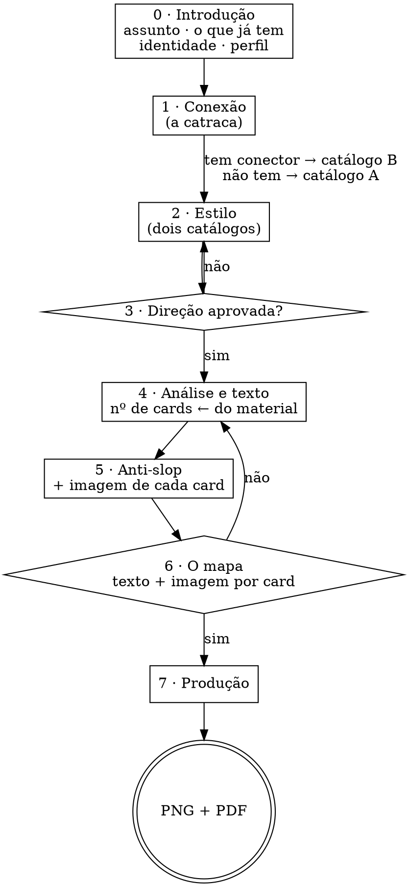

# Um Carrossel Por Favor

Carrossel de feed com arte-final. **Toda tipografia é renderizada em HTML/CSS e capturada em PNG.** Modelo de imagem entra só onde não há palavra a ler.

Tudo de que a skill precisa está dentro dela. Nada aqui depende de outra skill estar instalada — ver [CREDITOS.md](CREDITOS.md).

## Os três princípios

**1. Modelo de imagem erra letra — e erra o acento primeiro.** Nenhuma palavra que o leitor vai ler sai de gerador de imagem. Nem o título, nem a paginação, nem o arroba. Não é preferência de qualidade: é a diferença entre entregar e refazer.

**2. Desenhar vem antes de gerar.** A maior parte do que um carrossel precisa — grade, blocos, ícones, abstração de interface, diagrama, tabela — se desenha em HTML/CSS/SVG com controle total e custo zero. **Interface desenhada em blocos ganha de print com filtro aplicado.** O gerador entra no que não se desenha: retrato, cena, textura, colagem. Ver [references/grafismos.md](references/grafismos.md).

**3. Nada avança sem aprovação.** Oito etapas com trava entre elas. Refazer oito cards renderizados custa muito mais do que uma pergunta.

## O fluxo



**A conexão vem ANTES do estilo, e essa ordem é o coração do fluxo.** Não é burocracia: é ela
que decide **qual dos dois catálogos** o usuário vê. Recomendar risografia a quem não vai ter foto
é vender o que não se entrega — a tinta riso existe para cair sobre imagem.

Essa etapa já foi uma pergunta de três opções — *sem foto · banco de imagem · sob medida* — e sumia em toda
sessão de teste, sempre pelo meio. A saída não foi escrever melhor: foi **deixar de perguntar**.
A capacidade de gerar imagem se **verifica**, e o resto virou binário. O banco de imagem saiu da
skill por inteiro — ela não busca mais em acervo de terceiro —, e o que sobrou são três origens
de imagem: **gerada**, **do usuário**, ou **desenhada em código**.

O protocolo de como perguntar — uma por vez, múltipla escolha, trava a cada bloco — está em [references/texto.md](references/texto.md). Este arquivo diz *o quê* e *em que ordem*.

## Onde a skill roda — e o que fazer quando falta o navegador

**A arte não é gerada, é impressa.** A skill escreve uma página com o card e um navegador tira a
foto dela em 1080×1350 — é daí que vem a letra certa, com acento. Isso torna o navegador um
requisito duro, e é o único que a skill tem.

Tudo o mais viaja dentro do pacote: as **15 fontes** em `assets/fontes/`, as **21 referências**,
o **board**, os dois esqueletos e os quatro scripts. Para os sete estilos, **rede não é
necessária em nenhum momento**.

| precisa | onde vive | se faltar |
|---|---|---|
| **navegador** (Chrome, Chromium, Brave, Edge) | no sistema | **não há etapa 7.** O `exportar.sh` procura em macOS e Linux, no PATH e no cache do Playwright, e **para com mensagem** se não achar |
| **bash e python3** | no sistema | sem os scripts, as travas não rodam — ver abaixo |
| mostrar imagem ao usuário | `open`, artefato, ou imagem na mensagem | use a rota que a superfície tiver; o importante é **confirmar que ele viu** |
| perfil | `~/.claude/`, ou a pasta do trabalho | pergunte o que faltar, e grave onde der |

### Sem navegador, entregue menos — e diga que é menos

**Não monte arte pela metade.** O que a skill entrega sem renderizador continua sendo trabalho
real, e é isto:

- o `TEXTOS.md` com o texto aprovado e a régua anti-slop passada
- o `DIRECAO.md` fechado: paleta, fontes, grade, e as linhas `estilo:` e `conector:`
- o `cards.html` e o `fonts.css` prontos, com as fontes já embutidas em base64

E uma frase ao usuário, sem rodeio: *"aqui não tem como imprimir os PNGs. Está tudo pronto —
numa máquina com Chrome, um comando entrega a arte."*

**Por que isso importa mais do que parece.** Quase toda trava desta skill é executável: o
`exportar.sh` sozinho tem oito pontos de parada, e o que faz a etapa 1 não ser pulada é o board
abrir, não a regra estar escrita. **Prosa já falhou nos testes — foi por isso que as travas
viraram código.** Num ambiente sem execução, a skill volta a ser a versão que já se sabe que não
segura, e montar arte assim entrega defeito com cara de entrega.

## Três regras de conversa que valem o fluxo inteiro

### O usuário vê o carrossel dele uma vez: pronto

**Não existe preview antes da etapa 7.** Nem capa, nem card do meio, nem "um teste rápido para
você ver a direção". A primeira arte com o assunto dele que chega ao usuário é a arte final,
com o texto aprovado, a imagem de cada card já decidida e os cards todos montados.

Isso não é economia de rodada, é o oposto: **preview cedo custa rodadas.** Ele chega antes de a
imagem estar decidida, então mostra uma versão que nem sequer é a que vai ser produzida — desenhada
em código quando a decisão vai ser gerador, ou o contrário. O usuário opina sobre uma peça
descartável, o texto ainda é provisório, e metade dos comentários é sobre palavra que já ia
mudar. Duas vezes em teste a conversa parou para discutir um card que não existiria.

**A escolha de estilo não precisa de render** — para isso existem as 21 referências fixas em
`assets/referencias/`, que são imagens de verdade e mostram o estilo em três arquétipos de
layout. Escolhe-se olhando aquilo.

### Retomando um trabalho: as etapas já respondidas não se refazem

O fluxo está escrito para quem começa do zero, e **metade das sessões reais não começa do zero.**
O usuário chega com um `TEXTOS.md` aprovado numa conversa anterior e decide conexão e estilo numa
frase só — *"com mcp higsfield layout risografia"*. Rodar as oito etapas em cima disso é
exatamente a queixa nº 1 de quem testa a skill, com a agravante de que agora tem razão.

| o que existe | o que isso fecha |
|---|---|
| `TEXTOS.md` com os blocos no formato | **etapas 4, 5 e 6** |
| `DIRECAO.md` com paleta, fontes e as linhas `estilo:` e `conector:` | **etapas 1, 2 e 3** — e sem a linha `estilo:` a 2 **não** está fechada, por mais que a paleta esteja lá |
| o usuário nomeia o gerador e o estilo na mesma frase | **etapas 1 e 2** |
| chapas ou gabaritos na pasta | o laço já rodou — **não regere** |

O que sobra é gravar o que falta no `DIRECAO.md` e ir para a etapa 7. E a confirmação vira **uma
linha só, afirmativa**, nunca uma bateria de perguntas:

> *"Montana Grind, 8 cards, @timeriding, risografia, gerador ligado. Certo?"*

**Antes de retomar, ecoe o que você leu do arquivo.** Uma linha: *"li 8 cards, assinatura
@timeriding, assunto Montana Grind"*. Custa uma frase e pega o erro que quase produziu um
carrossel inteiro do assunto errado — o usuário mandou o `TEXTOS.md` de outro trabalho, e só não
passou porque o conteúdo era obviamente de outro tema. Com dois trabalhos parecidos, passa.

### Antes de perguntar, tente parsear

A regra de **uma pergunta por mensagem** existe para o usuário não perder resposta num bloco de
cinco. Ela **não** autoriza reperguntar item a item o que ele já disse numa linha — aí ela vira o
próprio defeito que devia evitar.

Se a mensagem dele respondeu N etapas, **ecoe as N decisões numa frase afirmativa e peça o
aceite**. A regra de uma por vez vale para o que **falta**.

### Nunca pergunte duas vezes a mesma coisa

Na etapa 0 você já ficou sabendo: **quem assina, onde publica, o assunto e quantos cards.**
Nada disso se pergunta de novo mais adiante. Se precisar confirmar, **afirme e peça o aceite**
— "são sete cards, certo?" — nunca "quantos cards você quer?". Repetir a pergunta faz parecer
que você não estava prestando atenção, e é a queixa mais comum de quem testa a skill.

Antes de perguntar qualquer coisa, releia o que já foi dito na conversa. Se a resposta está lá,
use.

### Fale como quem explica para um cliente, não para outro programador

A pessoa do outro lado quer um post bonito. Ela não precisa saber como a peça é feita.

| não diga | diga |
|---|---|
| "vou renderizar em HTML/CSS e capturar via headless" | "vou montar a arte e te mostrar" |
| "aplicando duotone com mapeamento de rampa na paleta" | "vou deixar a foto nas cores do estilo" |
| "o corpo está com 28px, abaixo do piso" | "o texto ficou pequeno demais para o feed, vou subir" |
| "gerando o gabarito para extrair as coordenadas" | *não diga nada — isso é trabalho interno* |
| "detectei conflito na área de segurança" | "isso ia sumir no corte do LinkedIn, arrumei" |

**Etapa intermediária não se narra.** Gabarito, medição, teste de fonte, chapa limpa: some com
tudo. Quem pede um carrossel quer ver o carrossel.

E quando algo der errado, diga **o que ficou ruim e o que você vai fazer** — não o nome técnico
do defeito.

---

## Etapa 0 — Introdução

Quatro coisas, uma pergunta por mensagem, **sem jargão**. As três primeiras são sobre o
trabalho; a quarta é o perfil.

◇ **1 · Sobre o que é o seu carrossel?**

◇ **2 · Você já tem os textos e as imagens?**

| | o que isso fecha |
|---|---|
| **não tenho nada** | fluxo inteiro: a skill escreve e resolve a imagem |
| **tenho só os textos** — ou pelo menos uma ideia | a etapa 4 vira leitura e organização, não entrevista |
| **tenho só as imagens** — não precisa ser todas | são **material**, com os direitos dele. A etapa 4 escreve em cima do que a imagem já diz |
| **tenho texto e imagem** — só preciso da direção de arte | as etapas 4 e 5 encolhem ao mínimo: organizar, passar a régua, montar |

**Peça o material agora, não depois.** Se ele disse que tem, peça que suba — e aceite como vier,
sem pedir formato nenhum. Converter é seu trabalho, não dele.

#### Disse que não tem imagens? Avise, na hora

**Vale mesmo que ele tenha os textos** — e é aqui, não na entrega. Diga assim, ou parecido:

> *"Um aviso que vale a pena agora: um carrossel bom precisa de **imagem que segure o olho** até
> o fim. Sem isso ele sai graficamente bonito e pouco relevante — as pessoas passam no card 3.*
>
> *O que resolve é uma das duas: **ligar um gerador de imagem aqui** — o que te dá imagem feita
> para o seu assunto —, ou **você me mandar fotos** que tenha, inclusive as que for buscar. Dá
> para seguir sem nenhuma das duas, e aí a peça vive só da tipografia e do desenho: em alguns
> estilos isso é forte, em outros é a versão reduzida."*

**Por que na etapa 0 e não depois.** Descobrir na entrega que faltou imagem é descobrir tarde: o
texto já foi escrito para um número de cards, o estilo já foi escolhido, e voltar custa tudo. Aqui
custa uma frase, e ele ainda tem as duas saídas abertas.

**E ofereça as quatro saídas, numeradas.** Ele responde com um número:

| | |
|---|---|
| **1 · Seguir sem imagem** | a peça vive de tipografia e desenho. Em terminal e brutalista isso é forte; nos outros é a versão reduzida, e você diz qual é o caso do estilo que ele escolher |
| **2 · Quero usar imagens gratuitas** | você devolve **a lista de bancos abaixo**, ele busca, escolhe e sobe. A skill não busca por ele |
| **3 · Tenho conta num gerador, quero conectar** | vai para a etapa 1, no passo a passo de conexão |
| **4 · Quero o melhor resultado, mas não sei se tenho conta** | vai para a etapa 1, no caminho **do zero** — criar a conta antes de conectar |

**As opções 3 e 4 não são a mesma.** Quem tem conta precisa de seis passos; quem não tem precisa
de vinte, e tratar os dois igual perde o segundo no primeiro clique. A etapa 1 separa os dois.

### A lista de bancos — opção 2

**A skill não consulta nenhum deles.** Ela entrega os endereços, ele busca e sobe o que escolher.
A diferença importa: o que saiu da skill foi a **busca programática** em acervo de terceiro, com o
problema de licença e de endpoint não público que ela trazia. Indicar onde procurar não tem esse
problema, e a procedência fica com quem escolheu a foto.

| | onde | o que tem de melhor |
|---|---|---|
| **Unsplash** | `unsplash.com` | mais de um milhão de fotos, e o acervo com menos cara de banco |
| **Pexels** | `pexels.com` | foto e vídeo em HD, bem organizado — o mais fácil de garimpar |
| **Pixabay** | `pixabay.com` | 4,2 milhões de itens, o mais variado |
| **Freepik** | `freepik.com` | vetor, ícone e ilustração além de foto |
| **StockSnap** | `stocksnap.io` | seleção profissional, atualizada com frequência |
| **Life of Pix** | `lifeofpix.com` | qualidade artística, acervo pequeno e bom |
| **Gratisography** | `gratisography.com` | estilo ousado e original — serve quando o assunto pede estranheza |
| **Burst** | `shopify.com/stock-photos` | feito para negócio e autônomo, do Shopify |
| **Styled Stock** | `styledstock.co` | visual claro em tons pastel |
| **The Noun Project** | `thenounproject.com` | ícone e pictograma, não foto |

**Diga duas coisas ao entregar a lista**, uma linha cada:

- **busque por assunto, nunca por estilo.** Procurar *"minimal aesthetic"* traz foto de banco com
  a estética por cima, que é o defeito. O estilo é nosso e entra depois
- **confira a licença de cada foto que baixar.** "Gratuito" nesses sites quer dizer coisas
  diferentes, e algumas pedem atribuição

**Diga uma vez e siga.** Se ele escolher a 1, siga — e não volte ao assunto. A etapa 1 ainda vai
verificar o conector; duas ofertas é insistência.

◇ **3 · Você já tem uma identidade visual fechada — cores e fontes definidas — ou quer escolher
uma direção comigo?**

Tendo identidade, ela **vence qualquer sugestão sua**: peça as cores em hex e o nome das fontes,
e confira se os arquivos existem antes de prometer usá-los. Fonte de marca passa pela conferência
de acentos como qualquer outra.

Não tendo, a direção nasce na etapa 2, dentro dos sete estilos.

### 4 · A conferência do perfil

Leia `~/.claude/carrossel-perfil.md` — e, se não houver, `carrossel-perfil.md` na pasta do
trabalho. **Existindo, mostre três linhas e peça confirmação**, nunca refaça as perguntas.

Não existindo, duas perguntas e só:

◇ **Como você quer assinar os posts?** (arroba · nome · nada)

◇ **Onde isso vai ser publicado?** (Instagram · LinkedIn · os dois · outro)

O resto do que o perfil guarda — público, voz, pasta padrão — se pergunta quando fizer falta, não
de véspera. As perguntas completas e o formato do arquivo estão em
[references/perfil.md](references/perfil.md).

**Há um terceiro estado, e ele é pedido com frequência:** *"esquece o que está salvo, faz como se
eu fosse novo"*. Rode o setup inteiro e **não leia o arquivo** — mas **não sobrescreva nem apague
o arquivo real**, e ao fim pergunte se o resultado deve substituir o que estava lá.

**O número de cards não se pergunta aqui.** Ele sai da análise do material, na etapa 4 — perguntar
antes de ler o que ele trouxe é pedir que ele adivinhe.

## Etapa 1 — Conexão

> **Esta etapa é uma catraca, e ela roda antes do estilo.** É a capacidade de gerar imagem que
> decide qual catálogo o usuário vai ver — e são dois catálogos diferentes, não um com asteriscos.

### Primeiro verifique. Só depois pergunte

**Não pergunte se ele tem conector: descubra.** Ferramenta que aparece na lista não é ferramenta
autorizada — faça uma chamada barata de leitura antes de contar com ela:

```
mcp__<servidor>_higs__balance     → devolve créditos e plano
```

Erro de autenticação significa não autorizado, e aí o caso é o de quem não tem.

**Tendo conector**, diga o que ele compra e siga — sem cerimônia:

> *"Você tem o Higgsfield ligado aqui, com N créditos. Vou usar: com ele o card inteiro nasce
> composto e a tipografia entra por cima, limpa. É a melhor versão desta skill."*

### Não tendo, ofereça conectar — e diga por quê

Esta é a **forma mais rica** de a skill trabalhar, e vale dizer isso com todas as letras. Com
gerador, a imagem responde ao assunto dele em vez de ser o que existia; a peça inteira nasce
composta; e os sete estilos ficam disponíveis em pé de igualdade.

**Se ele veio da opção 3 ou 4 da etapa 0, pule a pergunta abaixo — ele já respondeu.** Opção 3
("tenho conta, quero conectar") é resposta 1 da tabela; opção 4 ("não sei se tenho conta") é
resposta 2. Perguntar nome de novo é o que a "verifique, não pergunte" desta etapa quer evitar —
a verificação é o `balance`, que já rodou; a conta ele já disse que tem ou não sabe.

◇ **Você tem conta em algum gerador de imagem que a gente possa ligar aqui?** — só se ele chegou
aqui de outro jeito, sem passar pela etapa 0 (por exemplo: já tinha imagem própria, então o aviso
da etapa 0 nunca apareceu).

| | dá para ligar? |
|---|---|
| **Gemini** | sim, e é o mais fácil — a chave é grátis |
| **Higgsfield** | sim, por conector. Gasta crédito da assinatura |
| **Magnific** | sim, por conector. Serve para ampliar e recompor |
| **ChatGPT Plus ou Pro** | **a assinatura não serve.** O acesso automático é cobrado à parte |
| **Midjourney** | não liga. Mas dá para gerar por lá e me entregar o arquivo |

Três respostas, e as três seguem o trabalho:

| | o que você faz |
|---|---|
| **1 · Tenho conta, quero conectar** | o passo a passo de conexão. Seis passos, e ele já sabe onde é |
| **2 · Quero o melhor resultado, mas não sei se tenho conta** | **o caminho do zero** — criar a conta antes de conectar. É outro roteiro, abaixo |
| **3 · Não tenho, vamos seguir sem** | siga, e **sem insistir** |

**A 1 e a 2 não são a mesma pergunta com palavras diferentes.** Quem tem conta precisa de seis
passos; quem não tem precisa de vinte, e tratar os dois igual perde o segundo no primeiro clique
— ele abre uma página de preços que não entende e desiste.

### Caso 1 — ele tem conta

Um passo por mensagem, sempre. O roteiro por gerador está em
[references/geradores.md](references/geradores.md); confirme com a chamada de `balance` antes de
seguir, porque ferramenta que aparece na lista não é ferramenta autorizada.

### Caso 2 — do zero, e sem jargão

**Primeiro escolha por ele, não com ele.** Pedir que compare quatro produtos que ele não conhece
é devolver o problema. Pergunte só o que decide:

◇ **Você prefere uma coisa gratuita para testar, ou tanto faz pagar uns trocados por imagem?**

| ele diz | recomende | por quê |
|---|---|---|
| **grátis para testar** | **Gemini** | a chave é gratuita, sai em cinco minutos, e não pede cartão |
| **tanto faz pagar** | **Higgsfield** | conector, autoriza numa janela, e é o que compõe melhor cartaz |

E não ofereça as quatro. **ChatGPT Plus não serve** — o acesso automático é cobrado à parte, e
essa é a confusão mais cara desta etapa. **Magnific** só amplia e recompõe; não é para começar.

**Depois conduza, um passo por mensagem, esperando resposta em cada um.** Não mande a lista
inteira: quem precisa deste caminho se perde numa lista de dez passos. O roteiro completo de cada
um está em [references/geradores.md](references/geradores.md), e a regra é a mesma nos dois:

- **diga o que ele vai ver na tela antes de ele clicar** — *"vai abrir uma página com um botão
  azul escrito Create API key, no canto direito"*
- **uma coisa por vez, e espere o "pronto"**
- **se ele travar num passo, resolva aquele passo** — não recomece do início
- **a chave nunca é colada no chat.** Ele exporta no terminal e responde só "pronto". A skill
  grava o fato — `gemini: chave configurada em AAAA-MM-DD` — **nunca o valor**

**E diga quando parar.** Se depois de dois passos ele estiver claramente travado, ofereça a saída
sem constrangimento: *"dá para seguir sem isso agora e ligar depois — o carrossel sai do mesmo
jeito, com o desenho no lugar da foto."* Insistir aqui é onde a skill perde a pessoa.

**E diga a faixa de custo antes de começar**, não depois: com conector o laço do gabarito custa
**4 créditos por card no caminho feliz, 6 a 8 quando a geometria precisa de segunda tentativa**.
Quem tem 60 créditos precisa saber disso enquanto ainda dá para escolher outro caminho.

### Sem conector, o carrossel continua completo

Diga isso uma vez, em uma linha, e siga: **três dos sete ficam inteiros sem imagem nenhuma** —
terminal, brutalista e neo-brutalismo, onde o desenho já é o material. Os outros quatro pedem
imagem, dele ou gerada. Incentivar a conexão é honesto porque ela
**é** melhor; empurrar seria dizer que sem ela não dá — e dá.

Grave no `DIRECAO.md`:

```markdown
conector: higgsfield · verificado em AAAA-MM-DD
conector: nenhum · oferecido e recusado em AAAA-MM-DD
```

**O `exportar.sh` para se essa linha não existir** — ela é a prova de que a catraca rodou. E a
linha do recusado importa tanto quanto a do ligado: sem ela não dá para saber se a pergunta foi
feita ou pulada.

## Etapa 2 — Estilo

São **sete, fixos**, especificados em [references/estilos.md](references/estilos.md) com paleta em hex, par tipográfico, material e o cuidado verificado de cada um:

| | Estilo | Em uma linha | vive de |
|---|---|---|---|
| 1 | **Brutalista vetorial** | forma chapada de aresta dura sobre papel cru, tipografia condensada como material | forma |
| 2 | **Risografia com textura** | duas tintas que se multiplicam, erro de registro, retícula e fibra | **foto processada** |
| 3 | **Terminal** | paleta de editor de código sobre chumbo, grade de caractere e muito vazio | **vazio** |
| 4 | **Mixed media / colagem** | camadas de origens diferentes, toda emenda à mostra | **foto processada** |
| 5 | **Neo-brutalismo colorido** | contorno preto grosso e sombra dura sobre campo saturado | forma |
| 6 | **Minimalista editorial quente** | duas colunas, serifa de contraste alto, e muito vazio | vazio + **uma** foto |
| 7 | **Superminimal** | branco, preto, e a imagem entrando como bloco chapado — nenhum grafismo | **vazio + imagem** |

### São dois catálogos, e a etapa 1 escolheu qual

Não é o mesmo catálogo com ressalvas: são duas apresentações diferentes, porque **o que é bom
depende do que ele tem**. Recomendar riso a quem não vai ter foto é vender o que não se entrega.

**Os dois estão prontos, montados, e é só abrir:**

```bash
open <pasta-da-skill>/assets/catalogo-a.jpg    # sem conector
open <pasta-da-skill>/assets/catalogo-b.jpg    # com conector
```

Cada estilo aparece neles com as **três referências fixas** de `assets/referencias/` —
`<estilo>-1-split.jpg`, `-2-cascata.jpg`, `-3-bento.jpg` —, uma por arquétipo de layout. São três
porque uma capa bonita não prova nada: o que quebra no card 5 é o estilo não ter três composições,
e é exatamente isso que as três mostram.

**A numeração é do estilo, não da posição na lista** — brutalista 1, riso 2, terminal 3, colagem
4, neubrutal 5, editorial 6, superminimal 7. Ela é a mesma nos dois catálogos, no `estilos.md` e
no `DIRECAO.md`, de propósito: o usuário responde com um número, e ele precisa significar a mesma
coisa numa conversa que retome o trabalho depois. O catálogo A ordena por recomendação e os
números saem fora de sequência — isso é o certo, não um erro.

Para regerar qualquer um dos dois, `assets/catalogo/catalogo.html` é a fonte: `?c=a` e `?c=b`.

#### Catálogo A — sem conector

Ordenado pelo que aguenta o caminho sem gerador. **Diga a hierarquia em voz alta**, ela é a
informação:

| destaque | estilos | por quê |
|---|---|---|
| **em primeiro** | **terminal** · **brutalista** | dois dos três que ficam inteiros sem imagem nenhuma: o desenho já é o material |
| **e o superminimal**, se ele tiver as fotos | **superminimal** | com as imagens dele é o mais forte deste catálogo — recorte limpo cai direto no branco, sem tratamento. Sem imagem nenhuma, fica magro: a foto é o evento do estilo |
| **abaixo** | **neo-brutalismo** · **editorial** | funcionam bem, com o custo dito: o neubrutal **também fica inteiro sem imagem** — é o terceiro —, mas envelhece rápido; o editorial pede **uma** imagem grande e boa |
| **por último, com aviso** | **riso** · **colagem** | **perdem qualidade aqui.** A tinta riso existe para cair sobre imagem, e o recorte fotográfico é o centro da colagem. Em código viram retícula e recorte desenhados: funciona, mas é a versão reduzida |

#### Catálogo B — com conector

**Os sete em pé de igualdade, e sem considerações de qual serve melhor.** Com gerador ligado a
ressalva deixou de existir: todos recebem imagem sob medida, e a escolha volta a ser só de gosto.

Aqui o que se diz é o que **muda de patamar** — riso e colagem —, não o que fica devendo.

### O que fecha os dois catálogos

**São oito respostas possíveis, e a oitava é o zero:**

> **1 a 7** — o estilo que ele escolheu
> **0 — nenhum dos sete, quero mandar minhas referências**

**O zero não é enfeite de menu: é a saída de quem não se viu em nenhum dos sete**, e sem ela essa
pessoa responde um número por eliminação, ou trava. Ela existe nos dois catálogos, com o mesmo
destaque das outras.

> *"Ou, se você já tem uma referência que te agradou — um post, um cartaz, um print, um PDF —,
> escreva **0** e me manda. Eu leio e te digo de qual desses sete ela está mais perto."*

**Por que zero e não oito.** Oito leria como um oitavo estilo, e ele não existe: a referência
escolhe **entre** os sete e afina o escolhido. Zero lê como *"nenhum desses"*, que é exatamente o
que a pessoa está dizendo.

**E peça o número, não o nome.** Descrição por nome volta ambígua — *"aquele minimalista"* serve
para dois — e responder com um número é a coisa mais rápida que se pede a alguém no meio de uma
conversa.

### Se ele mandar uma referência própria

**Peça que suba, leia, e confirme antes de usar.** A leitura devolve uma hipótese, não um fato:

> *"Essa aí vive de foto tratada, com muito material impresso — entre os sete, ela é praticamente
> a colagem. É isso que você quer, ou você gostou de outra coisa nela?"*

**Confirmar não é formalidade.** Referência é ambígua por natureza: ele pode ter gostado da
paleta, da tipografia, do ritmo ou da foto, e cada uma dessas leva a um estilo diferente. Ler
errado e seguir custa o carrossel inteiro.

**E resolver não é escolher.** Mesmo confirmada, a referência **abre** o estilo — você ainda mostra
as três referências dele e ele ainda diz sim. As cinco perguntas da leitura, o que devolver e a
regra de que referência não vira um oitavo estilo estão em
[estilos.md](references/estilos.md#ler-uma-referência-trazida-pelo-usuário).

Se for **PDF ou tiver várias páginas**, diga qual página você leu — capa, miolo e fecho têm
composições diferentes, e ler só a primeira resolve para o estilo errado.

### Como mostrar

**Mostrar é o objetivo; `open` é só uma das rotas.** Use a que a superfície tiver — `open`, imagem
anexada na resposta, artefato. As referências são arquivos dentro do pacote, então em qualquer
ambiente existe **alguma** forma de pôr aquela imagem na frente do usuário.

> **E se não houver nenhuma, a etapa não é pulada — ela fica mais explícita.** Descreva, diga em
> uma linha que escolher sem ver é pior, e **pergunte assim mesmo**. Foi exatamente aqui que a
> etapa evaporou em produção: sem conseguir mostrar, o fluxo seguiu como se a decisão já tivesse
> sido tomada. Não mostrar é um problema de qualidade; **não perguntar é escolher no lugar dele.**

**E para por aí.** Nada é renderizado com o assunto dele nesta etapa — a regra do preview está lá
em cima e vale aqui em primeiro lugar. Se ele ficar dividido entre dois estilos, mostre as seis
referências dos dois lado a lado e pergunte qual dos dois mundos é o dele; não desempate com arte
que vai ser jogada fora.

### Duas coisas ditas na hora da escolha

- **O neo-brutalismo colorido tem prazo de validade.** É o visual mais usado em post de design
  hoje: acerta fácil e envelhece rápido. Isso muda a decisão, então é informação de antes
- **Escolheu fora da recomendação do catálogo A?** A escolha é dele e vale. Diga o que muda em uma
  linha, ofereça ligar um gerador **uma vez**, e siga. Insistir duas vezes é a diferença entre
  avisar e discutir com o cliente

Para a régua de gosto — escala, respiro, o que faz uma peça parecer cara e o que a faz parecer gerada por IA — use [references/visual.md](references/visual.md).

### A última pergunta da etapa 2 — só se ele subiu fotos

**Fechado o estilo, e só então**, resolva o que acontece com as fotos dele. Antes disso a pergunta
não existe: "quer nas cores do estilo?" sem estilo escolhido é oferecer o tratamento de uma direção
que ninguém decidiu.

◇ **Suas fotos: entram exatamente como você mandou, ou passam pelo tratamento da risografia?**

| opção | o que acontece |
|---|---|
| **exatamente como vieram** — o padrão | cor, luz, enquadramento e detalhe ficam intactos. O estilo aparece em volta: no tipo, nos campos chapados, na régua. **É o padrão porque a foto é dele** |
| **no estilo** | a foto passa pelo material daquele estilo — duas tintas na riso, três degraus no brutalista, recorte na colagem — e a peça fica de uma superfície só |

**No superminimal a pergunta quase não se faz:** ali não tratar é o certo por construção, porque
qualquer conversão de cor tira da foto exatamente o que ela veio trazer.

> **E o superminimal com fotos dele tem mais uma consequência, esta cara: o gerador não entra —
> nem se estiver ligado.** Aquele estilo é branco, preto e blocos de foto, sem grafismo nenhum;
> com as imagens na mão **não sobra nada para o gerador fazer**. Rodar o laço ali gastaria 4 a 8
> créditos por card para produzir o que já existe, e o gabarito ainda voltaria com imagem
> inventada disputando espaço com a foto dele. Monta-se tudo em código, com o `esqueleto.html`.
> O `exportar.sh` reconhece o caso pelas duas linhas do `DIRECAO.md` e abre a trava do gabarito
> sozinho. Nos outros seis não vale: neles o gerador ainda tem o que fazer com a foto — tinta,
> retícula, recorte, campo.

**Mostre, não descreva — e isto não fere a regra do preview.** Trate **uma** foto dele e ponha as
duas lado a lado. É a foto, não é um card: sem texto, sem diagramação, sem paginação. A regra do
preview existe contra card montado com texto provisório; aqui não há nem card nem texto. E o
princípio da skill puxa para o mesmo lado — **ninguém escolhe direção visual lendo adjetivo.**

Nunca mostre a foto tratada **dentro de uma maquete de card**. Aí vira preview, e aí a regra vale.

## Etapa 3 — Aprovação da direção

Não avance sem resposta explícita.

Se o usuário pedir **mistura de dois estilos**, não renderize um teste — a regra do preview vale
aqui também. Resolva por escrito, que é mais rápido e mais claro: diga **qual dos dois manda em
cada camada** — paleta, tipografia, material, grafismo —, porque estilo misturado quebra
justamente quando as duas disputam a mesma camada. Feche isso no `DIRECAO.md` e siga.

Ao fechar, registre em `DIRECAO.md` na pasta do trabalho: paleta em hex com o uso de cada cor,
fontes com nome de arquivo, lógica de grade, como cada tipo de card se comporta, e a linha
`destino:` — vem da resposta já dada na etapa 0 (Instagram · LinkedIn · os dois · outro), não se
pergunta de novo. Sem essa linha o `exportar.sh` assume **os dois** e monta o PDF de LinkedIn
mesmo quando ninguém pediu — foi o que aconteceu nos três testes de UX em paralelo, e a única
correção manual que os três precisaram fazer foi apagar esse PDF. Formato:

```markdown
destino: instagram
destino: linkedin
destino: os dois
```

**E é aqui que se pergunta o rodapé**, não na abertura: ◇ *tem logo, ou fica só o arroba em
texto?* Agora existe direção para ele pertencer.

**Duas linhas têm formato exato, e o `exportar.sh` para se qualquer uma faltar.** A primeira é o
estilo, e ela é a prova de que a etapa 2 aconteceu:

```markdown
estilo: riso · aprovado por ele em AAAA-MM-DD
```

Escreva-a **só depois do sim explícito**. Estilo deduzido de uma referência, herdado do perfil ou
escolhido por você porque "combina com o assunto" não é escolha dele — e essa etapa era a única
do fluxo sem trava justamente quando sumiu em produção.

A segunda é a conexão, e ela é a prova de que a catraca da etapa 1 rodou — com a linha do
**recusado importando tanto quanto a do ligado**, porque sem ela não dá para distinguir "ele não
quis" de "ninguém perguntou":

```markdown
conector: higgsfield · verificado em AAAA-MM-DD
conector: nenhum · oferecido e recusado em AAAA-MM-DD
```

Sem ela a etapa 7 não sabe que existe gerador ligado e monta pelo caminho de quem não tem — foi
assim que um Higgsfield conectado terminou sem laço de gabarito nenhum. Os arquivos do laço ficam
como `gabarito-NN.png` e `chapa-NN.png`.

E uma terceira, quando ele subiu fotos, dizendo o que foi decidido na última pergunta da etapa 2:

```markdown
fotos: do usuário · sem tratamento
fotos: do usuário · tratadas no estilo
```

Sem essa linha a etapa 7 decide sozinha, e o padrão silencioso de qualquer diagramador é aplicar
o estilo — que aqui é o contrário do certo.

**Foto do usuário não abre um caminho novo.** Para tudo o que vem depois — ordem do catálogo,
tratamento, escolha de esqueleto — o que decide é onde está a massa da peça, e foto do usuário é
superfície fotográfica como qualquer outra. O que muda é a procedência, e isso a própria linha
registra.

**Nenhuma dessas linhas leva número.** O `exportar.sh` lê as quatro — `conector:`, `estilo:`,
`fotos:` e `destino:` — por extenso, com as palavras acima.

**Cheque os acentos antes de fechar.** Os pares dos sete estilos já foram conferidos glifo a glifo. Mas se o usuário trouxe fonte de marca, renderize `ÁÀÂÃÉÊÍÓÔÕÚÜÇ áàâãéêíóôõúüç` e olhe — o navegador troca só o glifo faltante por outra fonte, o que é pior do que quebrar, porque passa despercebido. Faltando: troque a fonte, ou use **`abrasileirar-fonte`** para desenhar os acentos no traço da própria fonte.

## Etapa 4 — Análise e texto

**Primeiro leia o que ele trouxe. Só depois abra a boca.** A etapa 0 perguntou o que existe e
pediu o material; agora ele é lido — texto e imagens — e é a leitura que decide tudo o que vem
daqui.

### O número de cards sai da análise, não de uma pergunta no vazio

**Proponha, com o motivo, e espere a resposta.** Nunca "quantos cards você quer?" — quem pede um
carrossel não tem como saber, e o número certo está no material dele:

> *"O que você mandou dá bem **oito cards**: são seis argumentos que não cabem juntos, mais capa e
> fecho. Dava para apertar em seis, mas dois deles ficariam com duas ideias no mesmo card. Fecha
> assim?"*

O que a análise procura:

| no texto | no material de imagem |
|---|---|
| quantas **ideias separadas** existem — cada uma é um card | quantos cards as imagens cobrem, e quais |
| o que é argumento e o que é exemplo do mesmo argumento | se elas contam uma sequência ou são avulsas |
| onde falta ponte — o card de contexto é o que mais some | se sobra imagem, ela vira card ou fica de fora |

E as réguas que não cedem: **8 a 10 no Instagram**, teto de 10 · **9 a 12 no LinkedIn** · e
**um card = uma ideia**, que não cede nunca.

**Não avance sem a resposta dele.** O número decide a estrutura inteira, e mudar depois é refazer.

### Depois do número, o texto

Quatro caminhos, e a etapa 0 já disse qual:

| ele trouxe | o que você faz |
|---|---|
| **nada** | escreve. Três perguntas antes — a tese · como termina · o dado que só ele tem — e nada mais |
| **uma ideia ou rascunho** | escreve em cima. Leia primeiro, aponte **em uma linha** o que falta para o arco fechar, e proponha o delta |
| **texto pronto, organizado** | não reescreva. Distribua nos cards e passe a régua |
| **texto pronto, mas grande demais ou fora de ordem** | **resuma e organize.** É o caso mais comum de quem traz texto: o material é bom e não cabe. Corte para o tamanho do card, mantenha as palavras dele onde der, e diga o que cortou |

**Duas perguntas do perfil moram aqui, e não na abertura:** *para quem é isso* e *qual é a voz*.
São as que mudam a redação, e perguntá-las agora — com o usuário já falando de conteúdo — é a
diferença entre uma pergunta útil e um formulário. Se o perfil salvo já responde, não repita.

**A entrevista das três perguntas é para quem tem assunto, não texto.** Rodá-la em cima de texto
pronto devolve ao usuário um mapa do que ele mesmo escreveu, e a resposta certa dele é *"isso eu
já te mandei"*.

A estrutura em quatro zonas, as regras de tamanho e a tabela por plataforma estão em
[references/texto.md](references/texto.md).

## Etapa 5 — Anti-slop e imagens, antes do mapa

**Duas coisas acontecem aqui, e as duas terminam antes de qualquer coisa chegar ao usuário.** Não
são duas rodadas com ele: é trabalho seu, e o que ele vê é o resultado das duas juntas, na etapa 6.

### 1 · A régua anti-slop, no texto

**Só texto.** Capa, corpo, CTA, legenda e alt text. Está embutida em
[references/anti-slop.md](references/anti-slop.md), com os arquivos em `references/anti-slop/`.
Não precisa instalar nada.

Se você passou o texto e não cortou nada, você não aplicou. Volte e aplique.

**O registro dos cortes vai no arquivo, não na resposta** — e a única exceção, o corte que
atropelou o que parecia voz deliberada, está em [anti-slop.md](references/anti-slop.md#o-registro-dos-cortes).

**A revisão de slop gráfico não é aqui.** Ela produzia texto genérico para descrever problema
visual — o oposto do que esta etapa faz. O que é visual se resolve olhando o PNG na etapa 7.

### 2 · A imagem de cada card, decidida

Card a card, e a decisão é uma destas três:

| origem | quando |
|---|---|
| **gerada** | há conector, e o card pede retrato, cena, textura ou colagem |
| **fornecida** | ele subiu uma que serve àquele card |
| **desenhada em código** | é estrutura: grade, diagrama, abstração de interface, ícone, tabela — e **é o caso mais comum** |

A rota de cada card e o repertório do que se desenha estão em
[references/grafismos.md](references/grafismos.md). Na dúvida, desenhe.

**O alt text é o briefing.** Ele foi escrito com o texto, antes de a arte existir, e descreve o
que o leitor deveria ver — o que faz dele a melhor fonte de assunto de imagem que existe na pasta,
porque já passou pela entrevista e já está no assunto do card.

**Nada disso vira arte ainda.** Aqui só se decide e se descreve. A arte é a etapa 7, e é uma vez só.

## Etapa 6 — O mapa

**É a única aprovação do fluxo, e ela junta as duas coisas** — o texto já deslopado e a imagem já
decidida — num artefato só:

```
CARD 01 · capa
  ESSE CARROSSEL / NÃO FOI FEITO / À MÃO
  Foi feito com uma só skill, que você instala e usa hoje.
  → imagem: gerada. Uma tira de quadros impressos saindo de uma máquina,
    em duas tintas riso, sangrando pela borda de baixo.

CARD 02 · o problema
  ...
```

Três linhas por card: **título · corpo · a imagem descrita em uma frase**. Mais o layout quando ele
foge do padrão do estilo — *"aqui a imagem toma dois terços e o título vai para o pé"*.

**Por que uma aprovação e não duas.** O texto e a imagem se julgam juntos: um corpo bom com a
imagem errada é um card ruim, e descobrir isso em duas rodadas separadas custa as duas. E o texto
que chega aqui já passou pela régua — **o mapa nunca é a primeira versão.**

### Como apresentar

Mostre **limpo** — sem justificar corte, sem memória de cálculo, sem explicar o processo.

**Diga isto, com estas palavras ou parecidas:**

> Os textos estão em `TEXTOS.md`, na pasta do trabalho. **Se quiser mudar qualquer palavra, edita
> direto lá e me avisa aqui** — eu regero a arte a partir do arquivo. Você não precisa mexer em
> código nem descrever a alteração no chat.

Isso não é conveniência, é a diferença entre uma rodada e cinco. E **só funciona se a arte ler o
`.md` de verdade** — o padrão está em [references/montagem.md](references/montagem.md). Se você
embutiu o texto no HTML, a promessa é falsa e o usuário descobre na primeira correção.

Ofereça **uma capa alternativa**. A capa é o único card que decide se os outros sete existem.

◇ **O mapa fecha assim?**

Não avance sem resposta explícita. Aprovado, começa a produção — e é a **primeira e única vez**
que ele vê a peça montada.

## Etapa 7 — Produção

Agora, e só agora, monte a arte — e esta é a **primeira e única vez** que o usuário vê a peça
dele. O manual técnico completo — esqueleto, captura, área de segurança, PDF e as armadilhas que
custam tempo — está em [references/montagem.md](references/montagem.md).

**Três coisas existem antes de você escrever a primeira linha de arte.** Se faltar qualquer uma,
a etapa que a produz foi pulada:

| | existe? | quem produz |
|---|---|---|
| `DIRECAO.md` com as linhas `estilo:` e `conector:` | senão o `exportar.sh` para, duas vezes | etapas 1, 2 e 3 |
| `TEXTOS.md` com o texto aprovado | senão a arte é chute | etapas 4 a 6 |
| número de cards confirmado | senão a grade não fecha | etapa 4 — **nunca a 0**, onde perguntar seria pedir que ele adivinhe |

### Antes do passo 1: há gerador ligado?

**Havendo conector, a produção é outra.** Não comece pelo esqueleto — comece
pelo **laço do gabarito**, em [references/geradores.md](references/geradores.md#o-laço-do-gabarito--quando-há-gerador-conectado).
Este é o erro que já aconteceu em produção: o gerador foi conectado, a skill gerou ilustração
solta e montou como se não houvesse gerador nenhum. **Conectar e não rodar o laço desperdiça a
única coisa que o conector compra.**

O laço tem cinco passos e eles estão no arquivo: **gera com texto descartável → mede a chapa →
acha a fonte pela `assets/regua-fonte.py` → refaz sem texto → monta o HTML por cima.**

Leve daqui as duas regras que decidem se ele fecha, porque as duas custam crédito quando se
esquece delas:

- **A chapa manda, o layout cede.** A proporção que volta não é a que foi pedida — desvios de até
  19 pontos, trocando de sinal entre rodadas. Gere, meça o vão que veio, dimensione o tipo para
  ele. Não peça fração; peça faixa desenhada e campo vazio grande
- **Mídia de referência prende geometria.** No mesmo card isso é o que você quer, e é o passo 4.
  **Entre cards diferentes é defeito** — congela os sete no enquadramento da capa. Quem mantém
  os cards irmãos é o bloco de estilo, e a tipografia já é a mesma porque é o mesmo CSS

### Com conector, o esqueleto é outro arquivo

| o `DIRECAO.md` diz | copie |
|---|---|
| `conector:` com um gerador ligado | **`assets/esqueleto-chapa.html`** |
| `conector: nenhum` | `assets/esqueleto.html` |
| **`estilo: superminimal` + `fotos: do usuário`** | `assets/esqueleto.html` — **mesmo com conector**, porque ali o laço não roda |

Não são o mesmo arquivo com outra cor. No `esqueleto.html` o grafismo é **filho** do card, e o
empilhamento rígido torna sobreposição impossível por construção. Com o laço, a chapa é o **fundo
sangrado do card inteiro** e o texto é absoluto dentro de um vão medido — não existe "o que
sobra", então o `flex` não protege nada e o `.gfx` fica vazio. Escolher pela linha `conector:` é
o que evita adaptar um no outro, que é reescrever a estrutura do card.

E o `?medir=1` do de chapa confere uma coisa a mais: **o bloco caindo fora do vão medido**, que
é letra sobre ilustração. Como as outras duas — título transbordando, bloco fora do quadrado
vivo —, ela produz PNG do tamanho certo quando falha.

> **As ferramentas do laço estão em `assets/ferramentas/`**, e três delas fazem o que este
> arquivo pede em prosa: `medir-chapa.py` devolve o vão de cada chapa. A outra, `montar.py`, é
> **exemplo trabalhado, não ferramenta de uso cego** — ela mostra como o corpo do título sai da menor entre duas restrições, mas tem o número
> de cards e o comprimento de linha de um trabalho específico dentro dela.

1. Copie o esqueleto da tabela acima e aplique a direção aprovada. **O HTML lê `TEXTOS.md`; ele
   não guarda texto**

   **Troque valores; não reescreva o CSS do zero.** Escrever um arquivo limpo parece mais rápido
   e é onde a produção quebra: o esqueleto carrega propriedades que não parecem importantes e são
   estruturais — `white-space:nowrap` no `.tt`, `overflow:hidden` no `.gfx`, a troca automática
   de entrelinha do `.q`. Quem reescreve perde as três e descobre depois de capturar. **Mude cor,
   fonte, tamanho e composição; a mecânica fica** — e o mesmo vale para o `exportar.sh`
2. `assets/fontes.sh <estilo>` gera o `fonts.css`. As 15 faces são **embutidas na skill**, não
   baixadas: o piso de entrelinha e o comprimento de linha do laço saem do arquivo, e uma
   revisão da fonte no Google mudaria os dois em silêncio
3. **`?medir=1` antes de capturar.** Obrigatório sempre que o corpo do título tiver sido
   calculado fora do navegador — a soma dos avanços do `hmtx` é otimista, e o navegador
   renderizou de 5,6% a 9,0% mais largo na medição
4. `assets/exportar.sh` captura os PNGs em 1080×1350 e monta o PDF
5. **Abra cada PNG e olhe.** Captura falha em silêncio: sai arquivo do tamanho certo, em branco
6. Passe a checagem antipadrão abaixo

**Apresente o resultado ao usuário, não o caminho da pasta.** Mandar alguém abrir um diretório
para ver o próprio trabalho é a pior parte de uma entrega boa.

**Mas confirme que ele viu.** Abrir um PNG com a ferramenta de leitura mostra a imagem **para
você, não para ele** — em várias superfícies isso não chega do outro lado, e a etapa vira uma
pergunta de aprovação sobre uma imagem invisível. Aconteceu em produção: a folha de contato foi
montada, descrita e submetida à decisão, e a resposta foi *"não estou vendo as gerações, onde
estão?"*. Uma rodada inteira queimada.

As rotas, em ordem:

| | Rota | Quando |
|---|---|---|
| 1 | `open <arquivo>` | qualquer superfície local. **É o padrão seguro** — abre no visualizador do sistema, e o arquivo aparece sem ninguém procurar pasta |
| 2 | artefato publicado | onde essa capacidade existir. Melhor para folha de contato, porque o usuário navega |
| 3 | imagem na mensagem | só onde a superfície de fato renderiza para quem lê |

Isso vale nas **duas** vezes em que imagem sai daqui: as referências fixas da etapa 2 e a arte
da etapa 7. Nas duas, **mostre e só então pergunte** — nunca as duas coisas na mesma mensagem
sem saber se a imagem chegou.

### O artefato só aparece com a arte pronta

**Etapa intermediária não vai para o usuário.** Gabarito, chapa limpa, medição, teste de fonte — tudo isso é trabalho seu. O que chega é o carrossel montado, com o texto já aplicado como sugestão final.

Mostrar o caminho parece transparência e é ruído: o usuário passa a opinar sobre uma imagem que vai ser jogada fora, e você gasta uma rodada explicando por que ela não é a peça.

Junto com o artefato, o aviso do `TEXTOS.md` da etapa 6 — e a parte que faz diferença dita explicitamente: **o corpo se reajusta ao espaço já reservado em cada card, então mudar uma palavra não desmancha a diagramação.**

### Formatos

| Destino | Arquivo | Observação |
|---|---|---|
| Instagram | PNG 1080×1350 (4:5) | um por card |
| LinkedIn | PDF sequencial **1080×1080** | o corte 1:1 central do mesmo PNG — ver abaixo |
| Stories | PNG 1080×1920 | só se pedirem |

**O PDF do LinkedIn é quadrado, e sai do próprio PNG vertical:** recorte cada card em
`y=135..1215` e monte o PDF com os recortes. **Não rediagrame nada** — e não precisa, porque a
margem do quadrado já foi reservada na diagramação, que é o que a área de segurança abaixo faz.
Se algo sumiu no corte ou ficou espremido nele, o erro está na diagramação, não na exportação.
O `exportar.sh` monta o PDF de cada destino que a linha `destino:` do `DIRECAO.md` pedir — **os
dois** por padrão, se a linha faltar.

O feed do LinkedIn é largo e reduz o documento, e a maioria dos carrosséis vai para os dois
destinos — então o caso do LinkedIn é o normal: **o piso de corpo é 34px** sobre 1080, e 30 é
exceção justificada.

### Área de segurança — obrigatória, sempre

**A área viva é um quadrado de 924×924 no centro do card** — `x 78..1002`, `y 213..1137`. Todo
texto mora ali dentro, **inclusive o pé**. Fora dela, até a borda, é sangria: grafismo entra,
texto não.

```
1080×1350  ┌──────────────────────────┐
           │      sangria · 135       │   grafismo pode entrar
    y=135  ├──────────────────────────┤ ← corte 1:1: a PÁGINA do LinkedIn
           │  ┌────────────────────┐  │
           │  │                    │  │
    y=213  │  │   924 × 924        │  │ ← área viva: todo o texto, e o pé
           │  │   x 78..1002       │  │
           │  │                    │  │
   y=1137  │  └────────────────────┘  │
   y=1215  ├──────────────────────────┤
           │      sangria · 135       │
           └──────────────────────────┘
```

**Por que 213 e não 135 em cima e embaixo.** Porque o corte 1:1 não é um recorte de emergência:
**é a página do LinkedIn**, e página tem margem. Encostar o texto em y=150 dá 165px de folga no
Instagram e **15px** no LinkedIn — o card sai apertado lá, e não há nada a fazer na exportação
porque o problema nasceu na diagramação. A margem tem que estar dentro do corte.

Repare que a área viva é **quadrada e do tamanho da largura útil**: os mesmos 924 nos dois eixos,
com 213 de sangria em cima e embaixo. Diagramando ali, os dois formatos saem certos do mesmo
arquivo — o vertical ganha respiro extra, o quadrado tem a margem que precisa, e nenhum dos dois
foi rediagramado.

O esqueleto traz o gabarito: `?card=N&safe=1` desenha o corte em vermelho e o quadrado vivo em
verde.

---

## Padrões de composição

**A capa tem título dominante.** A razão entre o título e o subtítulo é de pelo menos **2,5:1**. Título grande, sub pequeno, e nada mais — sem eyebrow, sem rodapé, sem rótulo, a menos que carreguem informação que o leitor precisa.

**Slot vazio não se preenche, se elimina.** Se o template criou uma caixa e você precisou inventar texto para ela, a caixa sai e o vazio vira respiro. Ver a auditoria de slots em [references/anti-slop.md](references/anti-slop.md).

**O grafismo é mudo.** Se você desenhou algo e precisou escrever um rótulo para ele se explicar, o problema é o desenho. Texto dentro de grafismo só é legítimo se veio da etapa 4, aprovado, ou se é dado duro e verdadeiro.

**Ritmo por arquétipo — executável, não prosa.** `assets/esqueleto.html` tem os três arquétipos — `split` (duas colunas, título domina), `cascata` (camadas giradas, cortadas pela borda), `bento` (grade de células desiguais, uma sempre vazia) — como o parâmetro `layout` de `conteudo()`. Gire com `layout:ROD(n)`, já pronto no arquivo; **não escolha o arquétipo à mão card a card**. Antes desta correção só existia um arquétipo no código (chamado `split` mas sem a estrutura de duas colunas que o nome promete), e a instrução em prosa de girar entre os três nunca teve com o quê — oito cards saíam na mesma silhueta. Isto não vale para o `esqueleto-chapa.html`: ali quem decide a composição é a chapa gerada, não o CSS.

**Havendo gerador conectado, todos os cards nascem de gabarito gerado** — não só a capa. O laço
está na etapa 7. A capa é o piso, não o teto: se o crédito for curto, gere a capa e o fecho e
desenhe o miolo, mas diga isso ao usuário com o número de créditos, não decida em silêncio.

Duas regras sobre essa imagem, ambas em [references/grafismos.md](references/grafismos.md):

- **O assunto vem do tema, não do estilo.** O teste da troca reprova imagem que só combina com a paleta
- **A especificação do estilo vai no prompt.** Paleta em hex, idioma visual, material e proibições — o gerador devolve a peça já na linguagem. Foto neutra tingida com duotone depois lê como foto tingida, não como peça da direção. E se a imagem já veio na paleta, **tire o duotone do CSS**: ele achata o acento

## Hierarquia quando algo não couber

Sacrifique nesta ordem, **de baixo para cima**:

1. **Leitura** — nunca cede. Corpo sobre papel sólido, tamanho que se lê no feed
2. **Respiro** — cede pouco. Vão vazio é composição, não desperdício
3. **Grafismo** — cede primeiro. Encolhe, corta, ou sai

Texto sobrepondo grafismo é falha estrutural, não ajuste fino. Resolva com áreas de grid separadas — `txt` e `gfx` nunca dividem a mesma área, em nenhum dos três arquétipos — onde o texto reserva o espaço de que precisa e o grafismo fica com o que sobra. O esqueleto já é assim, nos três.

## Checagem antes de entregar

Se qualquer item aparecer na arte, ela lê como feita por IA genérica:

- [ ] Gradiente índigo → violeta, ou qualquer gradiente de dois roxos
- [ ] Vidro fosco: card translúcido com blur e borda branca de 1px
- [ ] Blob 3D, esfera de vidro, forma orgânica renderizada
- [ ] Glow neon atrás de texto ou forma
- [ ] Ícone dentro de tile pastel arredondado
- [ ] Sombra gigante e difusa embaixo de tudo
- [ ] Layout de landing de SaaS: hero centralizado e três cards iguais
- [ ] Emoji como elemento gráfico
- [ ] **Texto legível vindo de modelo de imagem**

E mais:

- [ ] Todos os PNGs abertos e olhados, um a um
- [ ] **Cada título lido em voz alta olhando o PNG.** Cauda de `Ç`, `Q` ou `J` que pousa sobre
      uma letra da linha de baixo **vira o acento dela** — `O ALMOÇO CHEGA / NA PISTA` leu
      `NA PISTÁ` com 3px de folga, sem encostar em nada. Nenhuma conferência automática pega
      isso, e o piso de entrelinha não impede: ele resolve colisão, não leitura. É irmão do
      `ABRASILEIRAR` lendo `ABRASILEITRAR` por erro de registro
- [ ] **Nenhum texto coberto — nem por grafismo, nem por outro grafismo.** Em terminal, colagem
      e em qualquer cascata os elementos se sobrepõem por projeto: o que come letra ali não é o
      texto do card sobre o desenho, é um elemento do desenho sobre o texto de outro
- [ ] Nada essencial fora do quadrado vivo de 924×924 — e **olhe o PDF quadrado**, não só o PNG:
      é lá que a falta de margem aparece
- [ ] Nenhum corte ou overflow — confira também os 8px finais de cada PNG
- [ ] **Foto do usuário saiu sem tratamento**, salvo se ele pediu. O `#duo` do esqueleto vem
      ligado e é fácil esquecer de tirar — confira olhando, não confiando no CSS
- [ ] Print de app real revisado por dado pessoal: nome, e-mail, cliente, token
- [ ] Acentos conferidos, se entrou fonte de fora dos sete estilos
- [ ] Ritmo: passando os cards em sequência, algo muda de posição ou escala
- [ ] Alt text escrito, um por card — **e conferido contra a arte que saiu**, não só contra a
      lista. O alt text da etapa 4 descreve a arte que ainda não existe e é excelente briefing
      de imagem, melhor que inventar assunto na hora porque já passou pela entrevista. O preço
      disso é o inverso: se a arte divergir, **o alt text vira mentira e nada checa**
- [ ] Legenda passou pela mesma régua anti-slop

## Red flags — pare e volte uma etapa

Estes pensamentos aparecem quando o usuário diz "tenho pressa". Todos custam mais tempo do que economizam.

| O que você vai pensar | O que é verdade |
|---|---|
| "Com pressa, conversa de setup é hostil" | Roda uma vez e fica salva. Errar a lista invalida os oito cards |
| "Descrevo os sete estilos, ele escolhe pelo nome" | Ninguém escolhe direção visual lendo. Abra as três referências fixas do estilo |
| "Pergunto o estilo primeiro, imagem depois" | Era assim, e não funcionava. **É a conexão que abre o catálogo:** verificada depois, ela vira detalhe — e o estilo escolhido pode ser justamente o que menos aproveita a imagem que ele tem |
| "Ele mandou uma imagem, então é para usar no card" | Pergunte qual das duas coisas é. Referência é como ele quer que fique; imagem para entrar na arte é material, com direitos dele. Confundir põe a foto dentro do card sem ninguém ter decidido isso |
| "A referência dele é a direção, vou reproduzir" | Ela escolhe entre os sete e afina o escolhido. Direção inventada na hora sai bonita na capa e quebra no card 5 — é a razão de os sete serem fechados |
| "Mostro só os recomendados, é mais rápido" | O usuário precisa saber que são sete. O catálogo ordena, não esconde — e três deles ficam inteiros sem imagem nenhuma, o que é informação de decisão |
| "Meu default escuro com acento neon é bonito e seguro" | É exatamente o visual que hoje lê como IA. Seguro e indistinguível são a mesma coisa |
| "Renderizo uma capa rápida só para ele ver a direção" | Arte nenhuma existe antes da etapa 7 — nem para adiantar, nem para ilustrar a conversa. Ela viria antes de a imagem estar decidida, mostrando uma peça que não é a que será produzida, e com o texto ainda provisório |
| "Ele tem conector ligado, então já sei tudo" | Ter conector não é querer gastar crédito neste post. Diga a faixa — 4 créditos por card no caminho feliz, 6 a 8 com vaivém — antes de começar, não depois |
| "Não tem gerador, então é tudo desenhado em código" | Falta perguntar se ele tem fotos. E não tendo nem uma coisa nem outra, **diga o que isso custa na etapa 0** — a peça sai correta e pouco relevante, e ele merece saber enquanto dá para resolver |
| "O gerador acertou a letra dessa vez" | Acertou nessa geração. Não vai acertar nas oito. E o acento é onde ele erra primeiro |
| "Ele mandou o texto, mas vou entrevistar pra garantir" | Devolve a ele um mapa do que ele mesmo escreveu. A entrevista é para quem tem assunto; quem tem texto pula a etapa 4 e vai para o anti-slop |
| "Ele tem as fotos, então não preciso verificar o conector" | As fotos dele cobrem alguns cards, não o carrossel. Pergunte quantos, e resolva o resto com ele — não em silêncio, na entrega |
| "Gero a imagem e ajusto o texto pra caber" | O texto passa a servir a imagem. Inverte a peça inteira |
| "Isso é fácil de desenhar, gero mais rápido" | Gerar custa uma rodada de prompt, uma de download e uma de recorte. Um `<div>` custa uma linha |
| "Não tem navegador aqui, mas eu monto a arte de outro jeito" | Não existe outro jeito: a arte é impressa por um navegador, e é daí que vem a letra com acento. Entregue o texto e os arquivos prontos, e diga que a impressão é numa máquina com Chrome |
| "A referência dele resolveu para colagem, então o estilo está escolhido" | Resolveu é sugestão sua; escolhido é ele dizendo sim. Pular esse passo faz a escolha voltar no meio da montagem, como pergunta sobre um card que não fecha — foi assim que a etapa 2 sumiu em produção |
| "Não consigo abrir as referências aqui, sigo com a que faz mais sentido" | Não mostrar é problema de qualidade; **não perguntar é escolher no lugar dele.** Descreva, diga que escolher sem ver é pior, e pergunte assim mesmo |
| "O mapa é só um rascunho, o anti-slop roda depois" | O mapa é texto que vai ao usuário, e a regra diz *qualquer texto*. Pior: é onde a ESTRUTURA se decide, e estrutura com slop não se conserta reescrevendo frase — se refaz o carrossel |
| "Superminimal com as fotos dele e conector ligado — rodo o laço" | Não roda. Ali não sobra nada para o gerador fazer: o estilo é branco, preto e blocos de foto. Gastaria crédito para refazer o que já existe, e o gabarito voltaria inventando imagem em cima |
| "Pergunto logo na etapa 1 se ele quer as fotos no estilo" | Não há estilo ainda. A pergunta é a última da etapa 2, quando dá para dizer o nome e mostrar uma foto dele tratada ao lado da original |
| "A foto dele fica melhor na paleta do estilo, vou aplicar o duotone" | Foto do usuário entra COMO ELA É. Ele subiu aquela foto porque é o produto, o trabalho ou a pessoa dele — tingir em duas tintas destrói o que ele queria mostrar. Ofereça uma vez; sem o sim, não trate |
| "Depois eu olho os PNGs" | Captura falha em silêncio. Olhe antes de entregar, um por um |
| "Mando a pasta e ele abre" | Entrega é o que ele vê, não o que ele encontra |
| "Tenho gerador ligado, gero as ilustrações e monto" | Ilustração solta e colada no card não é o que o conector compra. Com gerador, o card inteiro nasce dele e a letra entra por cima — é o laço do gabarito |
| "Peço 34% de ilustração e o modelo obedece" | Não obedece. Desvios de até 19 pontos, trocando de sinal entre rodadas. Peça faixa desenhada e campo vazio, depois **meça o que veio** e dimensione o tipo para ele |
| "Passo a capa como referência nos outros, pra ficarem irmãos" | Mídia de referência prende **geometria**: os sete saem no enquadramento da capa, por cima de instrução em caixa alta. Quem mantém a série é o bloco de estilo |
| "Gero o card sem texto, que é o que eu quero no fim" | Sem texto no prompt o modelo devolve ilustração, não cartaz. O texto da primeira geração é descartável; a composição dele é o produto |

## Sobre disparar agentes

**Faça tudo aqui, em sequência.** Subagente não pergunta nada ao usuário, e a premissa desta
skill é perguntar tudo — as etapas 0, 2, 3 e 6 são indelegáveis por natureza, e a 7 é o laço de
renderizar, olhar e ajustar com o usuário no meio, onde um agente só adiciona ida e volta e
perde o contexto visual.

O único caso que já compensou — renderizar previews de vários estilos em paralelo — **deixou de
existir**: não há mais preview de estilo. Sobra zero. Se o usuário pedir agente explicitamente,
é escolha dele; nunca é padrão.

## Onde delegar

| Situação | Vá para |
|---|---|
| Revisar texto que já existe, fora de carrossel | `sprayantislop` ou `deslopar` |
| Fonte de marca sem acento em pt-BR | `abrasileirar-fonte` |
| Peça única, não swipeable | `post-writer-sms` |
| Só a legenda do post | `caption-writer-sms` |

O que é só desta skill: a ordem das oito etapas, os sete estilos fechados, o desenho antes da geração, e a montagem em código.
